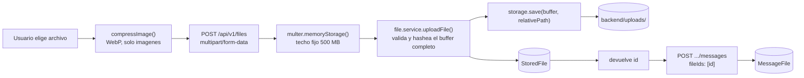
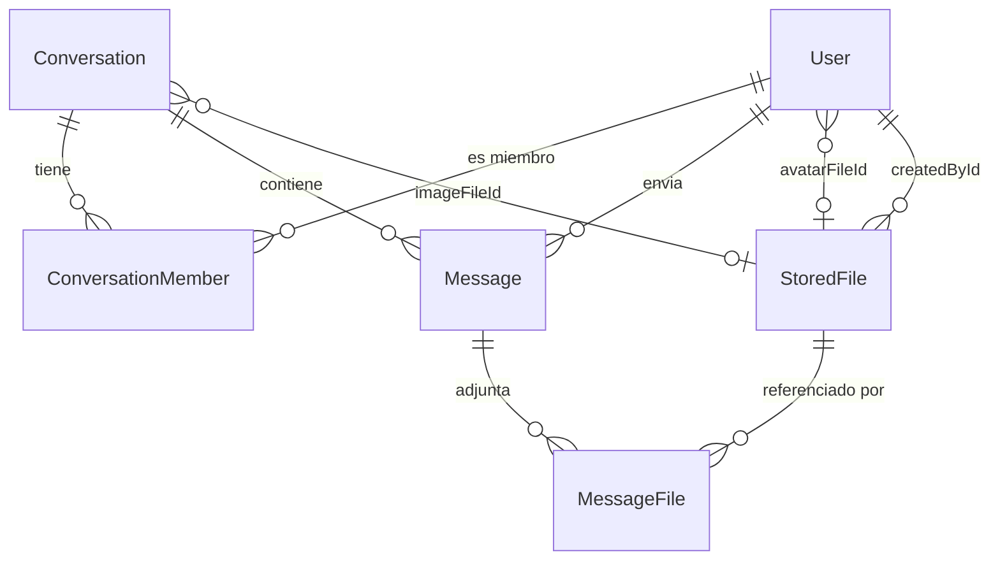
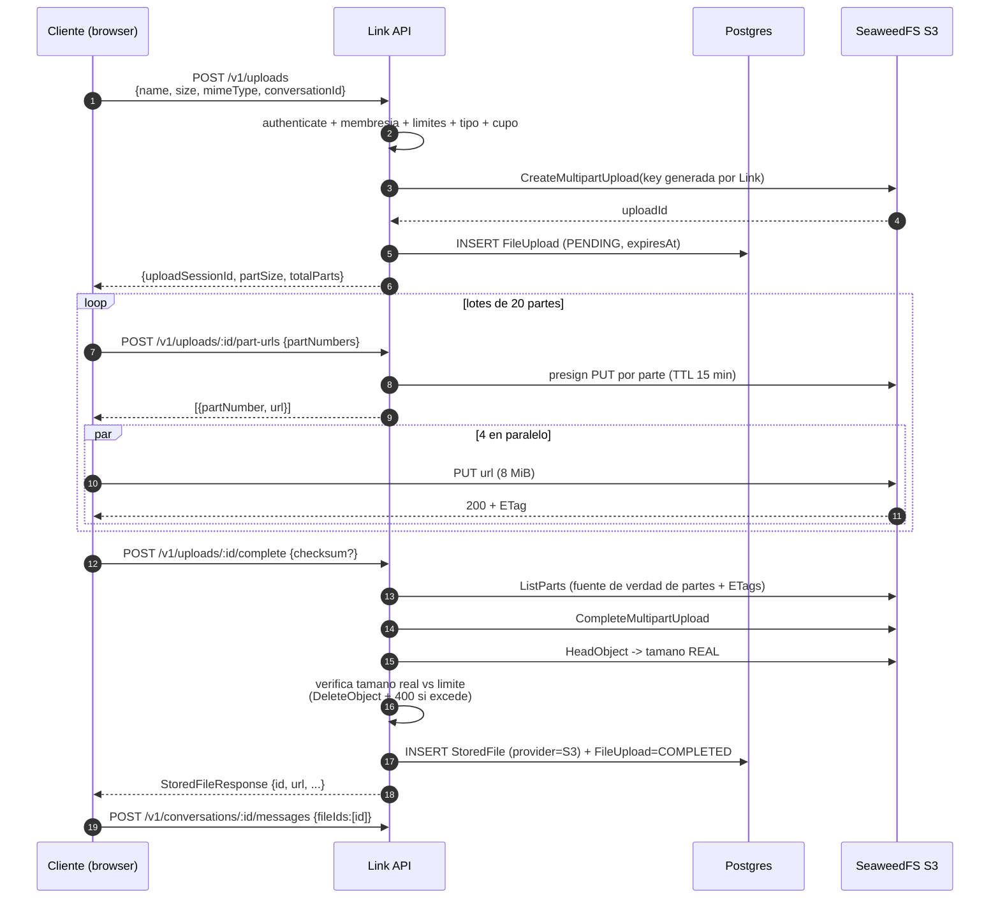
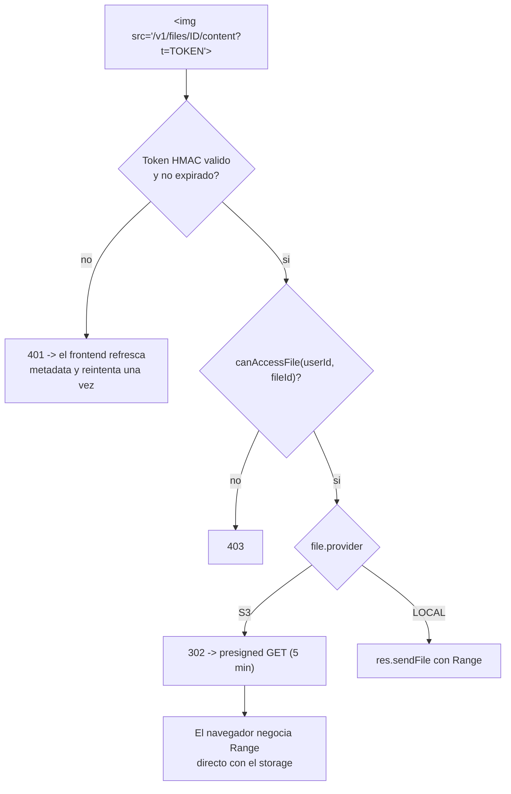
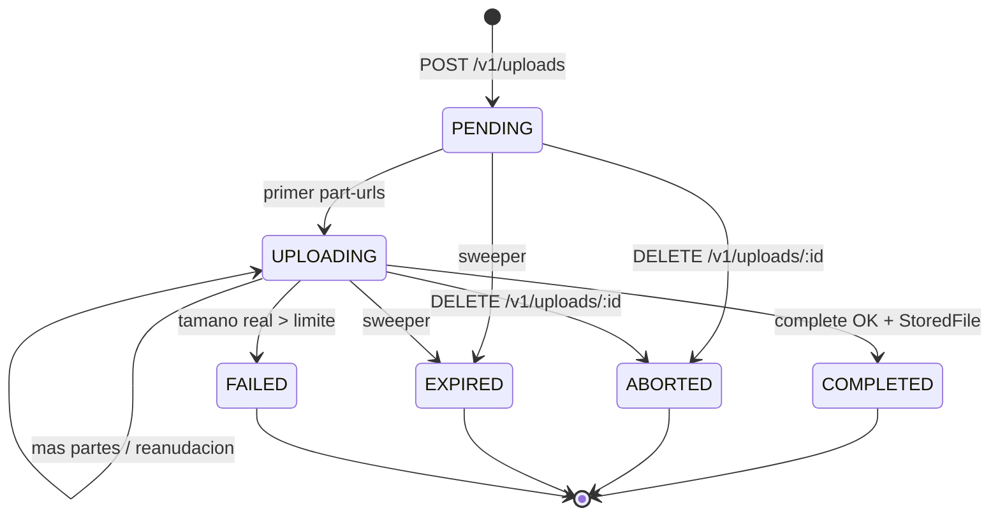
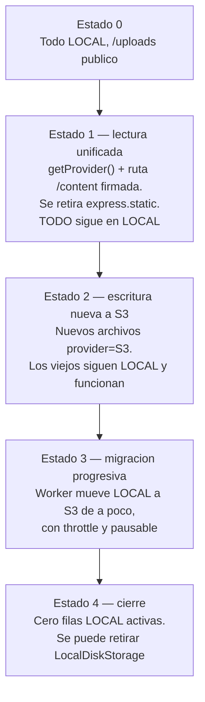
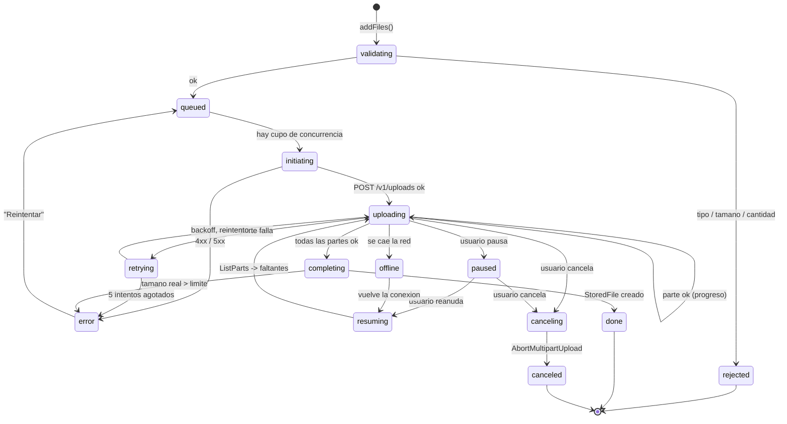
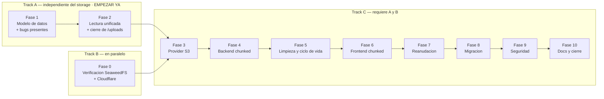

# Plan de Implementación — Archivos Grandes (≥ 2 GB) en Link

> **Documento único y fuente de verdad.** Consolida el análisis del proyecto, la decisión
> de almacenamiento (revisada y verificada) y el plan de ejecución por fases.
>
> **Estado: PROPUESTA — pendiente de aprobación.** No se ha modificado código de producción.
> Fecha: 2026-09-10 · Commit base: `06b26aa`
>
> Convención igual a [TESTING_PLAN.md](TESTING_PLAN.md): las fases se marcan `[x]` con
> fecha a medida que se cierran.

---

## Índice

1. [Cómo usar este plan](#1-cómo-usar-este-plan)
2. [Resumen ejecutivo](#2-resumen-ejecutivo)
3. [Estado actual del proyecto](#3-estado-actual-del-proyecto)
4. [Arquitectura objetivo](#4-arquitectura-objetivo)
5. [Diseño de datos](#5-diseño-de-datos)
6. [SeaweedFS: configuración concreta](#6-seaweedfs-configuración-concreta)
7. [Migración](#7-migración)
8. [Frontend y UX](#8-frontend-y-ux)
9. [Seguridad](#9-seguridad)
10. [Infraestructura](#10-infraestructura)
11. [Plan de ejecución por fases](#11-plan-de-ejecución-por-fases)
12. [Decisiones arquitectónicas](#12-decisiones-arquitectónicas)
13. [Riesgos](#13-riesgos)
14. [Preguntas abiertas](#14-preguntas-abiertas)
15. [Apéndice A — Registro de la decisión de storage](#apéndice-a--registro-de-la-decisión-de-storage)
16. [Apéndice B — Fuentes verificadas](#apéndice-b--fuentes-verificadas)

---

## 1. Cómo usar este plan

**Protocolo de reanudación** (para retomar en otra sesión, humana o de agente):

1. Leer §2 (resumen) y §12 (decisiones) — son ~4 minutos y dan todo el contexto.
2. Mirar la tabla de §11 para ver qué fase está abierta.
3. Leer la fase correspondiente completa antes de tocar código.
4. **Antes de un cambio no trivial:** `/graphify query "<pregunta sobre el área>"` o leer
   `graphify-out/GRAPH_REPORT.md`, para que el cambio sea consistente con la arquitectura
   ya registrada.
5. **Después de que la fase cierre:** `/graphify . --update` y marcar `[x]` con fecha acá.

**Política de tests (obligatoria, sin excepciones).** Todo cambio en `backend/src/**` o
`frontend/src/**` requiere al menos un test unitario del caso principal más los casos de
error/edge razonables — ver [AGENTS.md](AGENTS.md). Los criterios de mocking por capa
(Prisma, socket.io, red del frontend) están en [TESTING_PLAN.md](TESTING_PLAN.md) §3:
**reusarlos, no reinventarlos por archivo.** Cada fase de §11 lista qué testear.

---

## 2. Resumen ejecutivo

### 2.1 Lo que ya está a favor

El proyecto está diseñado para esto y hay mucho que **no** hay que construir:

- **`StoredFile`** es el modelo único de archivo de todo el sistema, y ya tiene
  **`provider` (`FileProvider`)** documentado explícitamente como el mecanismo de
  convivencia durante una migración `LOCAL → S3`.
- **`StorageProvider`** ya existe en `backend/src/storage/` con su singleton indirecto.
- **El flujo de adjuntos ya es de dos fases** (`POST /v1/files` → `id` → `fileIds` en el
  mensaje), y el frontend ya sube **al elegir el archivo**, no al enviar. Eso es
  exactamente el flujo que necesita un upload grande.
- **`messages`, `conversations` y sus validadores no cambian.**
- `httpServer.requestTimeout` ya está en 30 min. `express.static` ya sirve Range.
- Infra de Vitest completa (16 fases de `TESTING_PLAN.md` cerradas).

### 2.2 Los bloqueadores

| # | Bloqueador | Dónde | Tipo |
|---|---|---|---|
| B1 | `StoredFile.size` es `Int` → PG `int4`, máx `2 147 483 647`. Un archivo de 2 GiB son `2 147 483 648` bytes: **desborda por 1 byte** | [schema.prisma](backend/prisma/schema.prisma) | Bloqueador |
| B2 | `multer.memoryStorage()` con techo de 500 MB contra `max_memory_restart: "500M"` de PM2 → **hoy una sola subida grande reinicia el backend** | [file.route.ts](backend/src/modules/files/file.route.ts), [ecosystem.config.js](ecosystem.config.js) | **Bug activo** |
| B3 | Cloudflare corta el body en **100 MB** (Free/Pro), 200 MB (Business). Ningún ajuste de Node lo evita | verificado | Bloqueador |
| B4 | `StorageProvider` es **solo-buffer** (`save(buffer, path)`): sin streaming, multipart ni presign | [storage.types.ts](backend/src/storage/storage.types.ts) | Bloqueador |
| B5 | `/uploads` se sirve con `express.static` **sin autenticación**, y el frontend arma la URL desde el `path` crudo del `StoredFile` embebido en cada mensaje | [app.ts](backend/src/app.ts), [file-url.ts](frontend/src/utils/file-url.ts) | **Agujero de seguridad** |
| B6 | El composer se bloquea entero mientras sube un adjunto (`canSend = ... && !isUploading`) → con 2 GB el usuario no puede escribir por minutos | [MessageInput.tsx](frontend/src/features/messages/components/MessageInput.tsx) | Bloqueador de UX |

### 2.3 Las tres decisiones que definen el plan

**1. El límite de Cloudflare es por request, no por archivo.** En un multipart upload cada
parte es su propio request HTTP. **Con partes de 8 MiB, un archivo de 2 GB —o de 10 GB—
pasa por Cloudflare proxeado en cualquier plan**, conservando TLS, WAF y sin exponer la IP
del origen. No hace falta un registro DNS-only ni sacar el storage de detrás de Cloudflare.

**2. Storage: SeaweedFS ≥ 4.x con el filer sobre el PostgreSQL que Link ya opera.**
Decisión revisada y verificada — el detalle del porqué, incluidas las alternativas
descartadas y una corrección de una recomendación previa equivocada, está en el
[Apéndice A](#apéndice-a--registro-de-la-decisión-de-storage). Queda igualmente aislada
detrás de `StorageProvider`: cambiar de motor después es una clase y un `.env`.

**3. Se ejecuta en dos tracks paralelos.** Las Fases 1 y 2 arreglan B1, B2, B5 y B6 **sin
depender de ninguna decisión de storage** y se pueden empezar hoy; la Fase 0 valida
SeaweedFS + Cloudflare en paralelo. Si la validación saliera mal, el trabajo de las Fases
1 y 2 sigue siendo válido y desplegable.

---

## 3. Estado actual del proyecto

### 3.1 Stack verificado

| Capa | Realidad |
|---|---|
| Monorepo | npm workspaces: `backend/` + `frontend/` |
| Backend | Node + **Express 4.19**, TypeScript 5.5, **Prisma 7.9** (`@prisma/adapter-pg`), PostgreSQL, **socket.io 4.8**, **multer 2.2**, `yup`, `helmet`, `cors`, `morgan`, `express-rate-limit`, `web-push`, `music-metadata` |
| Frontend | **Next.js 16.2.11**, React 19.2.4, Tailwind 4, `socket.io-client`. HTTP vía `fetch` envuelto en `apiRequest` |
| Tests | **Vitest** en ambos workspaces + `supertest` |
| Deploy | **PM2**, `instances: 1`, `exec_mode: "fork"`, `max_memory_restart: "500M"` |
| Reverse proxy | **No hay nginx/Caddy/Docker en el repo.** Cloudflare se infiere de comentarios de código (`trust proxy 1`, `cf-connecting-ip`) y del dominio `https://link.example.org` |
| Auth | JWT HS256 emitido por **EXTERNAL_AUTH** (externo) |
| AWS SDK | **No existe** ninguna dependencia S3 hoy |

**Restricción de escalado:** socket.io no tiene adapter de Redis, así que PM2 **no puede
pasar de 1 instancia**. Por eso los workers in-process con `setInterval` (patrón de
[message-retention.worker.ts](backend/src/workers/message-retention.worker.ts)) siguen
siendo válidos, y por eso la contención del event loop importa (ver §4.6).

### 3.2 Flujo actual de archivos



### 3.3 Endpoints y autorización actual

| Ruta | Autorización hoy |
|---|---|
| `POST /api/v1/files` | `authenticate` + membresía si hay `conversationId` |
| `PUT /api/v1/auth/profile/picture` | `authenticate`, límite propio de 5 MB, exige `image/*` |
| `GET /uploads/*` (`express.static`) | **NINGUNA** — público con la URL |
| `GET /api/v1/files/:id` | Solo `authenticate` — **no verifica acceso al archivo (IDOR)** |
| `GET /api/v1/conversations/:id/messages/files` | `assertMembership` ✔ |
| `DELETE /api/v1/files/:id` | Solo el uploader; borrado **lógico**, no físico |
| `GET`/`DELETE /api/v1/admin/files/:id` | `requireRoles("admin")`; el DELETE **sí** borra físicamente |

Importación de stickers de Giphy: el **backend** descarga el archivo y llama
`storage.save` ([giphy.service.ts](backend/src/modules/giphy/giphy.service.ts)) — no pasa
por el navegador. Relevante para §4.2.

### 3.4 Modelo de datos actual



**Punto crítico:** un `StoredFile` **no pertenece a ninguna conversación**. El
`conversationId` de `POST /v1/files` solo decide la carpeta y **no crea relación alguna**
(documentado a propósito en [files/README.md](backend/src/modules/files/README.md)). Por
eso "¿puede X descargar F?" hay que **derivarlo** — ver §5.4.

### 3.5 Frontend relacionado

| Archivo | Rol y limitación |
|---|---|
| [use-message-attachments.ts](frontend/src/features/messages/hooks/use-message-attachments.ts) | Orquesta la subida. Solo 3 estados: `uploading` / `done` / `error` |
| [files.api.ts](frontend/src/features/files/api/files.api.ts) | `FormData` + `apiRequest` (fetch) → **`fetch` no expone progreso de upload** |
| [AttachmentPreviewChip.tsx](frontend/src/features/messages/components/AttachmentPreviewChip.tsx) | Spinner. Sin `%`, sin velocidad, sin cancelación de transferencia |
| [MessageAttachments.tsx](frontend/src/features/messages/components/MessageAttachments.tsx) | Usa `buildStoredFileUrl(file.path)` → **deriva la URL del `path` crudo** |
| [download-file.ts](frontend/src/utils/download-file.ts) | `fetch` → `blob` → `<a download>`. **Bufferea el archivo entero en memoria** |
| [compress-image.ts](frontend/src/utils/compress-image.ts) | Comprime a WebP. **Salta GIF y SVG** — relevante para §9 |

### 3.6 Problemas secundarios detectados (a resolver de paso)

1. **Los mensajes filtran el `StoredFile` completo.** `withRelations` en
   [message.repository.ts](backend/src/modules/messages/message.repository.ts) hace
   `files: { include: { file: true } }` → el payload expone `path`, `storedName`,
   `checksum` y `provider`.
2. **`_sum.size`** en el panel admin devolverá `BigInt` tras el cambio de tipo, y
   **`JSON.stringify` lanza excepción** sobre `BigInt`.
3. **Sin rate limiting en uploads** — `express-rate-limit` solo cubre login.
4. **`listFilesForAdmin` ordena por `createdAt` sin índice** en esa columna.
5. **`checksum` = SHA-256 del buffer completo** — exige el archivo entero en RAM.

---

## 4. Arquitectura objetivo

### 4.1 Principio rector

> El cliente habla con Link para **decidir** y con el storage para **transferir**.
> Link nunca toca los bytes de un archivo grande.

### 4.2 Dos caminos de subida (y por qué no se puede tener uno solo)

| Camino | Cuándo | Ruta |
|---|---|---|
| **Directo** (el actual, intacto) | ≤ **16 MiB** | `POST /v1/files` (multipart/form-data) |
| **Chunked** (nuevo) | > 16 MiB | `POST /v1/uploads` + PUT presignados + `.../complete` |

**El camino directo no se puede eliminar aunque se quisiera**, y esto es el argumento
decisivo: los **avatares** (`PUT /auth/profile/picture`) y la **importación de stickers de
Giphy** suben desde el servidor, no desde el navegador. Ese código path existe de
cualquier manera. Así que la pregunta nunca fue "uno o dos caminos" sino "dónde va el
umbral".

Además, el camino directo hace cosas que un upload directo al storage **pierde por
completo**: validación de mime sobre los bytes reales, duración de nota de voz vía
`music-metadata` (`kind: "voice_note"`), checksum calculado por el servidor, y compresión
de imagen.

**Costo, dicho explícitamente:** dos superficies de autorización, dos puntos de aplicación
del límite de tamaño y dos suites de test, de forma permanente. **Criterio: se conservan
los dos y no se converge**, precisamente porque el camino servidor-side es requisito de
Giphy y avatares. El umbral de 16 MiB es la única perilla.

### 4.3 Flujo completo de subida chunked



### 4.4 Parámetros del protocolo

| Parámetro | Valor | Justificación verificada |
|---|---|---|
| Tamaño de parte | **8 MiB** | Mínimo S3 es 5 MiB; 8 MiB × 10 000 partes = **78 GiB** de techo; **< 100 MB pasa por Cloudflare** en cualquier plan; reintentar cuesta 8 MiB, no el archivo |
| Concurrencia | **4** | 32 MiB en vuelo: memoria del navegador acotada, satura un enlace corporativo sin ahogar la app |
| Lote de presign | **20 URLs**, TTL 15 min | No presignar 256 de una: una URL presignada es un token de escritura, y un lote chico se re-presigna gratis al reanudar |
| Umbral chunked | **16 MiB** (2 × parte) | Ver §4.2 |
| Token de descarga (Link) | HMAC, TTL **1 h** | Ver §4.5 |
| Presigned GET | TTL **5 min** | Generado al vuelo en cada `302`, nunca persistido |

Verificación por tamaño: 2 GiB → 256 partes · 5 GiB → 640 · 10 GiB → 1 280. Todos holgados.

### 4.5 Descarga: el problema del ``

> **Una etiqueta `` no puede enviar la cabecera `Authorization: Bearer`.**

Hoy no importa porque `/uploads` es público. En el momento en que se exige permiso,
**todas las imágenes y notas de voz del chat se rompen** si el gate depende de un header.

| Opción | Veredicto |
|---|---|
| Cookie de sesión para la ruta de contenido | Rechazada: la app es Bearer/JWT de punta a punta; agregaría CSRF y complejidad de dominio |
| Presigned S3 directo en el payload del mensaje | Rechazada: el permiso se evalúa una sola vez al serializar, y expira a mitad de un scroll o de un `seek` de video |
| **Token propio de Link en query string + `302` a presigned** | **Elegida** |



Funciona en ``, `<audio>`, `downloadFile()` y `curl` por igual; mantiene el chequeo
de permiso **por request**; preserva Range y reanudación; y no requiere infraestructura de
sesión nueva.

Que el camino `LOCAL` pase por la **misma** ruta es lo que permite retirar
`express.static('/uploads')` y borrar `buildStoredFileUrl()`: queda **una sola** manera de
construir la URL de un archivo, y la corrección de seguridad cubre también los archivos
viejos sin esperar a que se migren.

### 4.6 Por qué el presigned GET es la mitad más importante

Vale dejar dicho, porque contradice parcialmente la intuición inicial:

**Para las subidas, "no pasar por Node" es más débil de lo que parece.** Un stream de
8 MiB usa 8 MiB de RAM, la copia socket→disco es casi toda kernel-side, y los streams no
bloquean el event loop.

**Para las descargas es más fuerte de lo que parece.** Si 20 personas bajan
simultáneamente un video de 2 GB, con disco local eso son 40 GB atravesando **el mismo
proceso Node que entrega los eventos de socket.io** — y PM2 está clavado en
`instances: 1`. Degradaría la mensajería en vivo para todos.

**Si alguna vez hay que recortar alcance, el presigned GET es la mitad que se conserva.**

### 4.7 Comportamiento en reinicios

| Escenario | Consecuencia |
|---|---|
| **Link se reinicia durante un upload** | **Invisible para el cliente.** Link no guarda estado de upload en memoria: la sesión está en Postgres, las partes en SeaweedFS, y el cliente sube a URLs presignadas que no involucran a Link. Solo fallan los `part-urls`/`complete` que caigan en la ventana, y el cliente los reintenta con backoff. **Hoy un reinicio mata cualquier subida en vuelo de multer** — es una mejora concreta |
| **SeaweedFS se reinicia (incluso sucio)** | Con el **filer sobre PostgreSQL**, el `uploadId` y el registro de partes heredan WAL y fsync de Postgres. El cliente ve fallos de red, reintenta, y al reanudar `ListParts` refleja exactamente lo que quedó |
| **Postgres se reinicia** | Igual que hoy para el resto de la app. Un `complete` en curso falla y se reintenta; un objeto completado sin fila `StoredFile` queda huérfano y lo barre el sweeper |
| **El cliente cierra la pestaña** | La sesión queda `UPLOADING`, expira, y el sweeper la aborta liberando las partes |

---

## 5. Diseño de datos

### 5.1 Cambios en modelos existentes (mínimos)

```prisma
enum FileProvider {
  LOCAL @map("local")
  S3    @map("s3")   // NUEVO — cubre SeaweedFS y cualquier S3-compatible
  @@map("file_provider")
}

model StoredFile {
  // ...
  size BigInt   // ERA Int -> int4 desborda en 2 GiB. Obligatorio.
  // ...
  @@index([createdById])
  @@index([deletedAt])   // NUEVO — el sweeper filtra por esto
  @@index([createdAt])   // NUEVO — listFilesForAdmin ordena por aca
}
```

**Nada más.** No se agregan `bucket`, `region` ni `endpoint`: son configuración del
proveedor, no del archivo. Guardarlos por fila duplicaría información y rompería el
principio ya documentado en `backend/README.md` ("las URLs no se guardan en la base de
datos"). `provider` + `path` alcanzan.

**Trampa de `BigInt` — 3 puntos obligatorios:**

1. `toStoredFileResponse()` → `size: Number(file.size)`. `Number.MAX_SAFE_INTEGER` son
   ~9 PB, sobra. **La API mantiene `size: number` y el frontend no cambia.**
2. `aggregateFilesForAdmin` → `_sum.size` vuelve `BigInt`, y **`JSON.stringify` lanza
   excepción**. Convertir en `listFilesForAdmin`.
3. Toda comparación `size > limite` debe ser `BigInt` vs `BigInt`, o convertir ambos
   lados. TypeScript no mezcla los tipos.

> Estos fallos son de **runtime**, no de compilación. Es el Riesgo 3 de §13.

### 5.2 Modelo nuevo: `FileUpload`

Una sesión de upload **no es un archivo todavía**, así que no va como columnas nullables
en `StoredFile`: ensuciaría el modelo central con estado transitorio y obligaría a
filtrar "uploads a medio hacer" en cada consulta existente.

```prisma
/// Estado de una sesion de subida chunked. Efimera: se crea al iniciar, muere
/// al completar/abortar/expirar. NUNCA es la fuente de verdad de que partes
/// llegaron — eso lo responde ListParts contra el storage (ver §5.3).
enum FileUploadStatus {
  PENDING   @map("pending")     // creada, sin partes todavia
  UPLOADING @map("uploading")   // al menos un part-urls pedido
  COMPLETED @map("completed")   // Complete OK + StoredFile creado
  ABORTED   @map("aborted")     // cancelada por el usuario
  EXPIRED   @map("expired")     // barrida por upload-cleanup.worker
  FAILED    @map("failed")      // complete rechazado (tamano real > limite)
  @@map("file_upload_status")
}

model FileUpload {
  id String @id @default(uuid())

  provider FileProvider
  /// Key generada SIEMPRE por Link, nunca propuesta por el cliente.
  objectKey String @map("object_key")
  /// uploadId del CreateMultipartUpload. Null hasta crearlo.
  externalUploadId String? @map("external_upload_id")

  originalName String @map("original_name")
  mimeType     String @map("mime_type")
  extension    String
  /// Tamano DECLARADO por el cliente. Solo sirve para rechazar temprano y
  /// calcular totalParts. El real se verifica con HeadObject al completar.
  declaredSize BigInt @map("declared_size")
  partSize     Int    @map("part_size")
  totalParts   Int    @map("total_parts")

  status FileUploadStatus @default(PENDING)

  /// SHA-256 que el cliente calcula incrementalmente. Ayuda de integridad,
  /// NO control de seguridad (lo declara el cliente). Ver §9.3.
  clientChecksum String? @map("client_checksum")

  createdById String @map("created_by_id")
  createdBy   User   @relation("FileUploadCreatedBy", fields: [createdById], references: [id])

  /// Solo namespacing + chequeo de membresia, igual que POST /v1/files.
  conversationId String?       @map("conversation_id")
  conversation   Conversation? @relation(fields: [conversationId], references: [id])

  /// Se puebla al completar.
  storedFileId String?     @unique @map("stored_file_id")
  storedFile   StoredFile? @relation(fields: [storedFileId], references: [id])

  createdAt DateTime  @default(now()) @map("created_at")
  updatedAt DateTime  @updatedAt @map("updated_at")
  expiresAt DateTime  @map("expires_at")
  closedAt  DateTime? @map("closed_at")

  /// El sweeper barre por (status, expiresAt) — sin este indice hace full scan.
  @@index([status, expiresAt])
  @@index([createdById, status])
  @@map("file_uploads")
}
```

Relaciones inversas a agregar: `User.fileUploads`, `Conversation.fileUploads`,
`StoredFile.upload`.

### 5.3 Estados, y por qué no hay tabla de partes



**Deliberadamente no hay tabla de partes en Link.** `ListParts` del storage es la fuente
de verdad autoritativa (partes + ETags). Duplicarla en Postgres introduce una clase entera
de bugs de deriva:

- parte subida pero fila no insertada → se re-sube al reanudar (leve);
- fila insertada pero parte perdida → se saltea la parte y **`CompleteMultipartUpload`
  falla al final** (grave).

Consultar `ListParts` no cuesta nada y no puede desincronizarse. **Los ETags nunca los
reporta el cliente**: los toma Link de `ListParts`, lo que además cierra un vector de
manipulación.

El estado del **archivo** no cambia: `deletedAt = null` (activo) vs `deletedAt != null`
(borrado lógico). **No se agrega máquina de estados a `StoredFile`.**

### 5.4 Derivación de permisos: `canAccessFile`

Un usuario puede leer el archivo `F` si **alguna** es verdadera:

1. `F.createdById === userId` — el uploader. **Imprescindible**: entre subir y enviar, el
   archivo no está atado a ningún mensaje y el usuario tiene que poder previsualizarlo.
2. `F` es el `avatarFileId` de algún `User` — los avatares son visibles en toda la
   instalación (ya lo son hoy).
3. `F` es el `imageFileId` de una `Conversation` donde `userId` es miembro.
4. Existe un `MessageFile` que referencia `F` en un `Message` de una `Conversation` donde
   `userId` es miembro.
5. `userId` tiene rol `admin` (coherente con el panel admin, que ya ve todo).

Se implementa en `file.service.ts` con **una** consulta. El índice `MessageFile.fileId` que
hace eficiente la regla 4 **ya existe**.

> La regla 4 no filtra por `Message.deletedAt`, mismo criterio que el resto del sistema
> (`replyTo`, `files[].file`): un mensaje borrado muestra placeholder, y quien ya tenía
> acceso no lo pierde retroactivamente. Revocar al borrar es una decisión de producto
> aparte (§9.3).

### 5.5 Huérfanos y borrados

| Caso | Detección | Acción |
|---|---|---|
| Sesión abandonada | `status IN (PENDING, UPLOADING) AND expiresAt < now()` | `AbortMultipartUpload` + `EXPIRED` |
| `StoredFile` completado nunca referenciado | `usage` todo en cero (ya lo calcula el panel admin) **y** `createdAt < now() - N h` | Borrar el objeto + marcar `deletedAt`. `N` default **24 h** — holgado: entre subir y enviar puede pasar rato |
| Soft-deleted hace mucho | `deletedAt < now() - M días` | Borrar el objeto físico. **La fila nunca se borra** (invariante existente: `MessageFile` debe seguir resolviendo a nombre/tamaño para el placeholder) |
| Objeto en el bucket sin fila en Postgres | Reconciliación bucket ↔ base | **Fase posterior. Solo reportar, nunca borrar automáticamente** |

Los tres primeros van en `upload-cleanup.worker.ts`, con umbrales en `AppSettings` y
**apagados por default** — misma política que `messageRetentionDays`: nunca borrar datos de
una instalación existente sin que un admin lo prenda.

### 5.6 Cómo se representa un archivo en un mensaje

**La estructura no cambia:** `Message` → `MessageFile` → `StoredFile`.

**Lo que cambia es la serialización.** Hoy `withRelations` manda el `StoredFile` crudo.
Pasa a la forma pública que **ya existe** (`toStoredFileResponse`), más `deletedAt`:

```ts
// message.types.ts — MessageFile.file pasa de StoredFile crudo a:
{
  id, originalName, mimeType, extension,
  size: number,          // Number(BigInt)
  url: string,           // /v1/files/<id>/content?t=<token firmado por Link>
  createdAt, deletedAt
}
```

Desaparecen del payload: `path`, `storedName`, `checksum`, `provider`, `createdById`. Es
simultáneamente (a) la corrección de la fuga de rutas físicas, (b) lo que habilita
presigned URLs, y (c) lo que permite borrar `buildStoredFileUrl()`.

**Consumidores de `withRelations` a verificar** (no solo el listado): `GET /messages`, el
socket `message:created`, `replyTo`, los reenvíos y `GET /messages/files`.

---

## 6. SeaweedFS: configuración concreta

### 6.1 Capacidades verificadas

| Capacidad que Link necesita | Estado |
|---|---|
| `CreateMultipartUpload` / `UploadPart` / `Complete` / `Abort` | ✔ |
| `ListParts` / `ListMultipartUploads` — base de la reanudación | ✔ |
| Presigned **PUT** | ✔ (presigned **POST policy no funciona** — Link no la usa) |
| Presigned **GET** | ✔ |
| `PutBucketCors` | ✔ **solo ≥ 3.95** |
| Range / 206 | ✔ documentado |
| `HeadObject` | ✔ |
| Addressing **path-style** | **Obligatorio**: el gateway falla con virtual-hosted |
| Lifecycle `AbortIncompleteMultipartUpload` | Poco claro → **Link hace su propia limpieza** (§5.5), que necesita de todos modos para cerrar su fila `FileUpload` |

### 6.2 Configuración obligatoria

No es opcional: es lo que hace válida la elección (ver [Apéndice A](#apéndice-a--registro-de-la-decisión-de-storage)).

| Parámetro | Valor | Por qué |
|---|---|---|
| Versión | **≥ 4.x estable** | CORS de S3 existe desde 3.95; usar la línea actual |
| Proceso | `weed server -s3`, **una unidad de systemd** | Un solo componente que administrar |
| **Filer store** | **PostgreSQL (`Postgres2`)**, base **separada** en la instancia existente | Backup consistente vía `pg_dump` + crash safety (WAL/fsync). Ver §6.4 |
| Addressing | `forcePathStyle: true` en el cliente | El gateway falla con `bucket.host` |
| Identidades | `s3.json` explícito, **ninguna identidad anónima** | **Sin identidades configuradas, el acceso anónimo es total** |
| Bind | `127.0.0.1`, publicado solo por el proxy/túnel | El gateway **nunca** directo a internet |
| CORS del bucket | Origen del frontend, `GET/PUT/HEAD`, expone `ETag`, permite `content-type` + `x-amz-*` | Sin esto **no hay upload directo desde navegador** |
| NTP | Sincronizado | SigV4 es sensible al reloj: desfase = 403 sin explicación |

**Tradeoff del filer en Postgres, dicho completo.** A favor: un solo dominio de backup
consistente, ops familiares, crash safety real. En contra: acopla la disponibilidad del
storage a la misma instancia de base (si Postgres cae, Link cae igual, así que no hay
pérdida marginal), y agrega una escritura de base por operación de archivo — a volumen de
Link (cientos a miles de archivos) es despreciable. **Base separada, no solo schema**, para
poder respaldar y permisar de forma independiente con la misma herramienta.

### 6.3 Buckets y keys

**Un solo bucket: `link-files`.** No uno por conversación: se crearían sin control, cada
bucket es una colección en SeaweedFS, y la separación lógica ya la da el prefijo.

Las keys **se conservan idénticas al `path` actual** — esto es lo que hace que la migración
sea un cambio de `provider` y no una reescritura de rutas:

```
chat/<conversationId>/<yyyy>/<mm>/<uuid>.<ext>   con conversationId
chat/<yyyy>/<mm>/<uuid>.<ext>                    sin conversationId
avatars/<userId>/<uuid>.<ext>                    avatares
giphy/<...>                                      stickers importados
```

`buildStorageDir()` y `safeExtension()` se reutilizan tal cual. El `uuid` sigue siendo la
garantía de nombre no adivinable.

### 6.4 Disco, backup y restauración

**Disco.** Durante un multipart las partes ocupan espacio **antes** de que el objeto
exista. Presupuestar `datos + (uploads concurrentes × 2 GB) + margen`. **Verificar
empíricamente en la Fase 0 si `Complete` duplica el espacio al ensamblar.**

**Backup — el orden importa y es contraintuitivo.** Son dos dominios: Postgres (metadata
de Link **y** del filer) y los volúmenes de SeaweedFS (los bytes).

> **`pg_dump` PRIMERO, `rclone` de los volúmenes DESPUÉS.**

El razonamiento: si la metadata se respalda en `T1` y los bytes en `T2 > T1`, la metadata
solo conoce objetos creados hasta `T1`, y **todos** están en el backup de bytes de `T2`
(que es un superconjunto). En el orden inverso, los objetos creados entre `T1` y `T2`
quedan referenciados por la metadata pero **ausentes** del backup de bytes → referencias
colgadas.

Los objetos extra que quedan en el backup de bytes sin fila que los referencie son
**huérfanos inofensivos**: los barre el sweeper de §5.5.

**Restauración:** bytes primero, después metadata, después arrancar servicios — así la
metadata nunca está viva apuntando a bytes que todavía no llegaron. **Un backup no probado
no es un backup**: la prueba de restore es requisito de la Fase 10.

---

## 7. Migración

### 7.1 El marcador ya existe

**`StoredFile.provider` es el marcador.** Ninguna columna nueva, ningún flag, ninguna tabla
de mapeo. Está documentado así en `backend/README.md`:

> *"Como cada `StoredFile` declara su propio proveedor, el sistema podría convivir con
> archivos guardados en distintos proveedores a la vez (por ejemplo, durante una migración
> gradual de `LOCAL` a `S3`) sin ambigüedad sobre dónde buscar cada uno."*

Identificar qué está migrado es literalmente `WHERE provider = 'S3'`.

### 7.2 El cambio que lo habilita

`src/storage/index.ts` pasa de exportar **un singleton** a exportar **un resolver**:

```ts
// ANTES:  export const storage: StorageProvider = new LocalDiskStorage();
// DESPUES:
export function getProvider(provider: FileProvider): StorageProvider           // lectura/borrado
export function getWriteProvider(): { provider: FileProvider; storage: StorageProvider }  // escritura
```

- **Lectura y borrado** resuelven por `file.provider` → cada archivo se lee/borra donde
  realmente vive.
- **Escritura** usa el proveedor configurado (default `S3`).
- `STORAGE_WRITE_PROVIDER=LOCAL` es el **rollback de la Fase 3 sin revertir código**.

### 7.3 Secuencia sin downtime



**El Estado 1 va primero, antes de que exista SeaweedFS.** Unifica la lectura y cierra el
agujero de `/uploads` sin que haya un solo archivo en S3 todavía. Es la fase de mayor
valor por menor riesgo, y se despliega y verifica de forma aislada.

### 7.4 El worker de migración

`src/workers/file-migration.worker.ts`, mismo patrón que el de retención:

- Toma `N` filas por tick con `provider = LOCAL AND deletedAt IS NULL`, **más chicas
  primero** (maximiza archivos migrados por unidad de riesgo, y los avatares —los más
  consultados— salen temprano).
- Por archivo: leer de disco (stream) → subir a S3 (multipart si supera el umbral) →
  **verificar** (`HeadObject`: el tamaño coincide; si hay `checksum`, re-hashear al vuelo)
  → `UPDATE StoredFile SET provider='S3', path=<key>` → **solo después** borrar el archivo
  local (o mejor: dejarlo y barrerlo en una pasada posterior, así el rollback es trivial).
- **Nunca borrar-y-después-actualizar.** El orden es: subir, verificar, commitear, y recién
  entonces (o mucho después) borrar el local.
- **Idempotente por construcción:** se maneja por `provider`, así que si se cae a mitad la
  fila sigue en `LOCAL` y se vuelve a tomar. Un objeto duplicado de un intento fallido
  queda huérfano y lo barre el sweeper.
- Controlado desde `AppSettings`: `fileMigrationEnabled` (**default false**),
  `fileMigrationBatchSize`, `fileMigrationIntervalMinutes`. Se prende y se apaga sin
  redeploy, igual que el resto de los límites.

### 7.5 Lo que se evita explícitamente

| Riesgo | Cómo se evita |
|---|---|
| Downtime | Los 4 estados son deploys independientes y compatibles hacia atrás |
| Romper mensajes viejos | `provider` resuelve por archivo; un mensaje de 2024 funciona en todos los estados |
| Perder archivos | Subir → verificar → commitear → *después* borrar. El local se conserva hasta cerrar |
| Migrar varios GB de golpe | Batch + intervalo + interruptor en `AppSettings` |
| `UPDATE` masivo | Solo `provider` y `path`, fila por fila, a medida que cada archivo se mueve |

---

## 8. Frontend y UX

### 8.1 Máquina de estados de un adjunto

Extiende `AttachmentStatus` (hoy `"uploading" | "done" | "error"`) sin romper la forma de
`PendingAttachment`:



### 8.2 Módulos nuevos y archivos a tocar

| Archivo | Cambio |
|---|---|
| `features/files/lib/chunked-uploader.ts` | **Nuevo.** Toda la mecánica: partición, cola con concurrencia 4, **`XMLHttpRequest` por parte** (necesario para `xhr.upload.onprogress`), backoff, re-presign en 403, pausa/cancelación por `AbortController`, hash SHA-256 incremental. **Sin React**, para poder testearlo aislado |
| `features/files/api/uploads.api.ts` | **Nuevo.** `initiateUpload`, `getPartUrls`, `getUploadStatus`, `completeUpload`, `abortUpload` vía `apiRequest` |
| `features/files/hooks/use-upload-progress.ts` | **Nuevo.** Velocidad (media móvil exponencial) + ETA |
| [use-message-attachments.ts](frontend/src/features/messages/hooks/use-message-attachments.ts) | **Extender.** Elige camino por tamaño (umbral 16 MiB) y expone los estados nuevos. `fileIds` sigue filtrando `status === "done"` — **el envío del mensaje no cambia** |
| [AttachmentPreviewChip.tsx](frontend/src/features/messages/components/AttachmentPreviewChip.tsx) | **Extender.** Barra de progreso, `%`, velocidad, ETA, botones pausa/reanudar/cancelar/reintentar |
| [MessageInput.tsx](frontend/src/features/messages/components/MessageInput.tsx) | **Corregir** el bloqueo del composer (§8.3) |
| [MessageAttachments.tsx](frontend/src/features/messages/components/MessageAttachments.tsx) | Usar `file.url` en lugar de `buildStoredFileUrl(file.path)` |
| [file-url.ts](frontend/src/utils/file-url.ts) | **Eliminar `buildStoredFileUrl`.** Ya no hay `path` en el payload |
| [download-file.ts](frontend/src/utils/download-file.ts) | **Corregir:** no bufferear a blob para archivos grandes. Navegar a la URL firmada con `Content-Disposition: attachment` → el navegador descarga con su gestor nativo (con pausa y reanudación propias) |
| [api-client.ts](frontend/src/lib/api-client.ts) | **No se toca.** Sigue siendo solo-JSON; el uploader XHR vive aparte |
| `providers/public-settings-provider.tsx` | Consumir los límites nuevos de `getPublicSettings()` |

`compress-image.ts` **no se toca**: sigue aplicando a imágenes, que caen del lado directo
del umbral. Un video de 2 GB no pasa por ahí.

### 8.3 El composer no se bloquea más

Hoy: `canSend = (Boolean(value.trim()) || fileIds.length > 0) && !sending && !isUploading`.

Con 2 GB eso deja al usuario sin poder escribir durante minutos.

- La subida se mueve conceptualmente a una **bandeja de subidas de la conversación**,
  independiente del composer.
- `canSend` deja de mirar `isUploading` global: solo exige que **los adjuntos que este
  mensaje va a llevar** estén `done`.
- Un adjunto que sigue subiendo simplemente **no entra** en `fileIds` de este mensaje.

### 8.4 Progreso, velocidad y ETA

- **Progreso** = `(partes completas × partSize + bytes en vuelo) / total`. Los bytes en
  vuelo vienen de `xhr.upload.onprogress`, así que la barra se mueve suave y no a saltos de
  8 MiB.
- **Velocidad**: media móvil exponencial sobre ventanas de ~1 s.
- **ETA**: `bytes restantes / velocidad`, mostrado **solo después de ~3 s** de datos
  estables. Un ETA con la primera muestra es ruido y se ve peor que no mostrarlo.

### 8.5 Reanudación: el límite honesto del navegador

Reanudar **dentro de la sesión** (caída de red, pestaña abierta) funciona: `GET
/v1/uploads/:id` → `ListParts` → subir solo las faltantes.

Reanudar **tras recargar la página requiere que el usuario vuelva a elegir el mismo
archivo**: el handle de `File` no sobrevive un reload. La File System Access API lo
resolvería pero es solo Chromium. **V1 hace reanudación intra-sesión**; el re-pick
validado por `name + size + lastModified` queda para una fase posterior. Decirlo en la UI,
no esconderlo.

### 8.6 Validación previa

En el cliente, en este orden: cantidad (`maxFilesPerMessage`, ya existe) → tamaño
(`maxUploadSizeMb`) → tipo (allow/blocklist). **El servidor sigue siendo la autoridad**
(mismo criterio que ya documenta `use-message-attachments.ts`); la validación cliente solo
evita empezar una subida de 2 GB destinada a fallar. La cola de modales de
`validationErrors` **se reutiliza tal cual**.

### 8.7 Cuándo se crea el mensaje

**Al enviar, como hoy** — cero cambios en `messages`. Lo que cambia es que la subida deja
de bloquear el composer (§8.3).

Un placeholder "subiendo" dentro del propio mensaje (estilo Telegram) es mejor UX pero
exige estados nuevos en `Message` y eventos de socket: **fase posterior, no V1.**

---

## 9. Seguridad

### 9.1 Amenazas que introduce el upload directo

| # | Amenaza | Por qué es real acá | Mitigación |
|---|---|---|---|
| S1 | **Subir más bytes que los declarados** | El `size` del paso 1 lo declara el cliente y las partes van firmadas por parte. Sin verificación posterior, `maxUploadSizeMb` **es inaplicable** | **`HeadObject` al completar** → tamaño real vs límite → `DeleteObject` + `400`. **No opcional** |
| S2 | **Subir un tipo distinto del declarado** | El mime declarado no se puede verificar sin leer los bytes | Firmar la parte con `Content-Type` fijo; y sobre todo: **el mime no gobierna la seguridad de la descarga** — la gobierna `Content-Disposition` (S6). Sniffing por magic number: fase posterior |
| S3 | **Object key injection** | Si el cliente propusiera la key, escribiría sobre `avatars/<otro>/...` | **La key la genera Link siempre.** El cliente solo recibe `uploadSessionId` y números de parte |
| S4 | **Bucket anónimo abierto** | **Sin identidades en `s3.json`, SeaweedFS permite acceso anónimo total** | Identidad única para Link, permisos solo sobre su bucket, **ninguna identidad anónima**, gateway en loopback |
| S5 | **Agotamiento de disco (DoS autenticado)** | Un usuario autenticado abre N sesiones de 2 GB, sube partes y nunca completa. Las partes ocupan disco real | Cupo de sesiones abiertas por usuario; cupo de bytes declarados en vuelo; `expiresAt` + sweeper; **alerta de disco** |
| S6 | **XSS almacenado vía archivo** | Un `.html` o **`.svg`** servido *inline* desde un origen con sesión = XSS. `compress-image.ts` **salta SVG a propósito**, así que los SVG llegan intactos al storage hoy | `Content-Disposition: attachment` **por default**, con allowlist chica de tipos inline seguros (`image/png\|jpeg\|gif\|webp`, `audio/*`, `video/mp4`) — **`image/svg+xml` fuera**. Servir desde un host distinto del de la app |
| S7 | **Inyección de cabecera vía nombre de archivo** | `originalName` se guarda crudo y va a ir a `Content-Disposition`, que hoy no existe. CR/LF o comillas rompen la cabecera | Codificar RFC 5987 (`filename*=UTF-8''...`) + filtrar caracteres de control. **Riesgo nuevo que introduce esta fase** |
| S8 | **Presign como amplificador** | Presignar es barato para Link y caro de auditar. Pedir 10 000 URLs es gratis para el atacante | Rate limit por usuario en `part-urls`; validar `partNumbers ∈ [1, totalParts]`; lotes acotados |
| S9 | **Desfase de reloj** | SigV4 es sensible al tiempo: si Link y el storage difieren, **todas** las firmas fallan de forma desconcertante | NTP en ambos. Documentarlo como causa probable de "403 inexplicables" |

### 9.2 Problemas preexistentes que este plan cierra

| # | Problema actual | Se cierra en |
|---|---|---|
| S10 | **`/uploads` público sin autenticación** — con la URL, cualquiera descarga sin sesión, incluido alguien fuera de la organización | **Fase 2**. Es el mayor beneficio de seguridad del plan |
| S11 | **`GET /v1/files/:id` no autoriza** — cualquier usuario logueado lee metadata de cualquier archivo (IDOR). **Crítico**: sin esto es el bypass del gate de descarga | Fase 2 |
| S12 | **El payload de mensajes filtra `path`, `storedName`, `checksum`, `provider`** | Fase 2 |
| S13 | **Un upload de 500 MB puede reiniciar el backend** (multer memoryStorage vs `max_memory_restart: "500M"`) | Fase 1 (techo 500 MB → 32 MB) |
| S14 | **Sin rate limiting en uploads** | Fase 1 |
| S15 | **Path traversal en `LocalDiskStorage`** — no alcanzable hoy (nombres generados por el servidor), pero al pasar a `res.sendFile` con un `path` que viene de la base, agregar contención con `path.resolve` como defensa en profundidad | Fase 2 |

### 9.3 Límites honestos de lo propuesto

- **El checksum del cliente no es un control de seguridad.** Lo declara el cliente: sirve
  para detectar corrupción de transporte, no manipulación. Verificarlo de verdad exige que
  Link lea el objeto completo de vuelta — posible de forma asincrónica en una fase
  posterior, no en el camino crítico.
- **Una URL firmada, mientras vive, es un token portador.** Un usuario legítimo puede
  compartirla fuera de la organización durante su TTL. Por eso los TTL son cortos (1 h el
  token de Link, 5 min el presigned) y no se persisten. Para una herramienta interna es
  aceptable; eliminarlo requeriría atar el token a IP o dispositivo.
- **Borrar un mensaje no revoca el acceso al archivo** (§5.4, regla 4), consistente con el
  resto del sistema. Revocar es una decisión de producto aparte.

### 9.4 Antivirus: fase posterior, no V1

Recomendación explícita de **dejarlo afuera de V1**, con razones:

- Escanear 2 GB obliga a **leer el archivo completo de vuelta a través del servidor** —
  exactamente lo que esta arquitectura existe para evitar.
- ClamAV necesita ~1–2 GB de RAM solo para firmas, en un servidor con
  `max_memory_restart: "500M"` por proceso.
- Sincrónico duplica el tiempo de subida; asincrónico deja el archivo descargable antes de
  estar escaneado, salvo que se agregue un estado que bloquee la descarga.

**Diseño para cuando se haga:** campo `StoredFile.scanStatus` (`PENDING` / `CLEAN` /
`INFECTED` / `SKIPPED`), worker post-completado, y `/content` rechazando `INFECTED`. Con
`scanStatus` nullable, agregarlo después **no rompe nada** — mismo patrón que `checksum`.

---

## 10. Infraestructura

### 10.1 Necesario para V1

| Área | Cambio |
|---|---|
| **Storage** | `weed server -s3` (≥ 4.x) en `127.0.0.1`, una unidad de systemd, identidades explícitas, **sin acceso anónimo** |
| **Filer** | **Base PostgreSQL separada** en la instancia existente (`Postgres2`). Agregarla a la rutina de backup |
| **Bucket** | `link-files` con **CORS**: origen `https://link.example.org`, métodos `GET, PUT, HEAD`, `ExposeHeaders: ETag`, headers `content-type` + `x-amz-*`. **Sin CORS no hay upload directo** |
| **Hostname** | Subdominio propio (ej. `storage.link.example.org`) **proxeado por Cloudflare (nube naranja)**. Con partes de 8 MiB el límite de 100 MB no aplica y se conservan TLS, WAF y ocultamiento del origen. **No usar DNS-only** |
| **Reverse proxy** | No hay ninguno versionado. Definir qué termina TLS y enruta ambos hostnames. **Si se agrega nginx:** `client_max_body_size 16m` (parte + margen) y **subir `trust proxy` de `1` a `2`** en `app.ts` — el propio comentario del código lo anticipa |
| **Firewall** | Puerto del gateway S3 **cerrado desde afuera**; solo loopback |
| **Node / Express** | `requestTimeout` ya está en 30 min. **Bajar** `ABSOLUTE_MAX_UPLOAD_BYTES` de 500 MB a ~32 MB |
| **PM2** | Sin cambios: `instances: 1` sigue siendo obligatorio por socket.io. Los workers nuevos corren in-process |
| **Env** (`env.ts` + `.env.example`) | `S3_ENDPOINT`, `S3_REGION`, `S3_BUCKET`, `S3_ACCESS_KEY_ID`, `S3_SECRET_ACCESS_KEY`, `S3_FORCE_PATH_STYLE`, `STORAGE_WRITE_PROVIDER`, `FILE_URL_SIGNING_SECRET` |
| **Disco** | Confirmar espacio libre. Presupuestar `datos + (uploads concurrentes × 2 GB) + margen`. Verificar si `Complete` duplica al ensamblar |
| **Backups** | **`pg_dump` primero, `rclone` de los volúmenes después** (§6.4) |
| **NTP** | Sincronizado (S9) |
| **Logs** | Ciclo de vida de cada sesión (`initiate` / `complete` / `abort` / `expire`) con `userId`, tamaño y duración. Mínimo para diagnosticar "no me deja subir" |
| **Monitoreo** | **Alerta de disco libre** (el umbral más importante) + conteo de sesiones `UPLOADING` estancadas |

### 10.2 Recomendado para después

- Adapter de Redis para socket.io (habilita `instances > 1`; hoy es el techo de escalado)
- Métricas Prometheus + dashboard (SeaweedFS ya las expone)
- Backup offsite con retención y **restore probado periódicamente**
- CDN / cache para avatares (muy consultados, casi nunca cambian)
- Antivirus asincrónico (§9.4)
- Sniffing de mime por magic number
- Reconciliación bucket ↔ base (solo reporte)
- Migrar los workers de `setInterval` a un scheduler real si alguna vez hay >1 instancia

---

## 11. Plan de ejecución por fases

### 11.1 Estructura en tracks



**Dos cambios de orden respecto de un plan lineal, ambos deliberados:**

1. **Las Fases 1 y 2 no esperan a la Fase 0.** Arreglan B1, B2, B5, B6 y S10–S15, que
   existen hoy y no dependen de qué storage se elija. Si la Fase 0 saliera mal, este
   trabajo sigue siendo válido y desplegable.
2. **La limpieza (Fase 5) va antes del frontend (Fase 6)**, no al final. En cuanto exista
   el backend chunked pueden acumularse sesiones abandonadas; poner el frontend antes del
   sweeper es habilitar a los usuarios a llenar el disco sin red de contención.

### 11.2 Índice de progreso

| # | Fase | Track | Estado |
|---|---|---|---|
| 0 | [Verificación SeaweedFS + Cloudflare](#fase-0--verificación-seaweedfs--cloudflare) | B | `[ ]` |
| 1 | [Modelo de datos y bugs presentes](#fase-1--modelo-de-datos-y-bugs-presentes) | A | `[x] 2026-09-10` |
| 2 | [Lectura unificada y cierre de `/uploads`](#fase-2--lectura-unificada-y-cierre-de-uploads) | A | `[x] 2026-09-10` |
| 3 | [Provider S3](#fase-3--provider-s3) | C | `[x] 2026-09-10` |
| 4 | [Backend del upload chunked](#fase-4--backend-del-upload-chunked) | C | `[x] 2026-09-10` |
| 5 | [Limpieza y ciclo de vida](#fase-5--limpieza-y-ciclo-de-vida) | C | `[x] 2026-09-10` |
| 6 | [Frontend del upload chunked](#fase-6--frontend-del-upload-chunked) | C | `[x] 2026-09-10` |
| 7 | [Reanudación y reintentos](#fase-7--reanudación-y-reintentos) | C | `[x] 2026-09-10` |
| 8 | [Migración progresiva](#fase-8--migración-progresiva) | C | `[ ]` |
| 9 | [Endurecimiento de seguridad](#fase-9--endurecimiento-de-seguridad) | C | `[ ]` |
| 10 | [Documentación y cierre](#fase-10--documentación-y-cierre) | C | `[ ]` |

---

### Fase 0 — Verificación SeaweedFS + Cloudflare

**Objetivo.** Validar los supuestos que **no se pueden verificar leyendo documentación**,
antes de escribir una línea de integración.

**Componentes.** Ninguno del repo. Un servidor de pruebas + un script y una página HTML
mínima en el scratchpad.

**Cambios.** Levantar SeaweedFS ≥ 4.x con filer PostgreSQL; crear el bucket; configurar
CORS e identidades; y probar **con la versión exacta que va a producción**.

**Dependencias.** Respuestas a §14 (preguntas 1–3).

**Riesgos.** Que CORS o presigned PUT no funcionen como se documenta a través de
Cloudflare. **Este es el punto de descubrirlo** — con un script, no con media feature
construida.

**Cómo probarlo — criterios de salida bloqueantes:**

1. **Presigned PUT desde un navegador real** (no `curl`: `curl` no hace preflight) contra
   el **dominio real con HTTPS detrás de Cloudflare**. Un test en localhost **no prueba
   nada de esto**.
2. **Preflight `OPTIONS`** llega al gateway y responde con los headers de CORS correctos.
3. **`ListParts`** responde coherentemente, y sigue haciéndolo **después de `kill -9` del
   proceso a mitad de un multipart** (valida el filer sobre Postgres).
4. **`HeadObject`** devuelve el tamaño real.
5. **Presigned GET con `Range`** devuelve `206` + `Content-Range` **a través de
   Cloudflare**.
6. **`Abort`** libera las partes.
7. **Medir si `Complete` duplica el espacio** en disco al ensamblar.
8. Confirmar que `forcePathStyle` es necesario y que el `Content-Type` firmado coincide.

**Terminada cuando.** Un archivo de 2 GB sube por partes de 8 MiB desde un navegador a
través de Cloudflare, se descarga con `Range`, y `ListParts` sobrevive un reinicio sucio.

> **Plan B documentado** si el criterio 1 o 2 fallara de forma irreparable: proxear las
> partes por Link (funciona con partes < 100 MB, a costa de que los bytes atraviesen Node).
> Las Fases 1, 2, 5, 8 y la mitad de 6 y 7 siguen aplicando sin cambios.

---

### Fase 1 — Modelo de datos y bugs presentes

**Objetivo.** Que 2 GB sea *representable* y que el backend deje de poder reiniciarse por
una subida. **Sin storage nuevo. Se puede empezar hoy.**

**Componentes.** `prisma/schema.prisma`; `file.repository.ts`; `file.service.ts`
(`toStoredFileResponse`, `listFilesForAdmin`); `file.route.ts`;
`middlewares/rate-limit.middleware.ts`; `settings.*` (service, repository, validator,
types) + panel admin del frontend.

**Cambios.**
- `StoredFile.size` → `BigInt` + las 3 conversiones de §5.1.
- Índices `@@index([deletedAt])` y `@@index([createdAt])`.
- `FileProvider.S3` en el enum.
- `ABSOLUTE_MAX_UPLOAD_BYTES` 500 MB → **32 MB** (S13).
- Rate limiter por usuario en `POST /v1/files` (S14).
- Límites nuevos en `AppSettings` (`maxUploadSizeMb` default a 2048) + `getPublicSettings`.

**Dependencias.** Ninguna.

**Riesgos.** Bajos, pero **el `BigInt` es traicionero**: `JSON.stringify` sobre `BigInt`
lanza excepción en **runtime**, no en compilación.

**Cómo probarlo.**
- `toStoredFileResponse` con `size = 3n * 1024n ** 3n` → serializa a `number` correcto.
- `listFilesForAdmin` → `totalSize` serializa sin excepción (el punto más fácil de olvidar).
- Comparación de tamaño con `BigInt` en ambos lados.
- `supertest` con body > 32 MB → `400` traducido por el `errorHandler`.
- `grep` de cada lectura de `.size` en el repo antes de cerrar la fase.

**Terminada cuando.** `npm test` verde en ambos workspaces; una fila con `size` > 2 GiB se
persiste y serializa; el panel admin funciona igual que antes.

**Cerrada 2026-09-10 — notas para quien retome el plan:**

- El grep de `.size` (obligatorio antes de cerrar la fase) encontró **tres sitios que la
  lista de "Componentes" de esta fase no mencionaba**, los tres necesarios para que
  `npm test`/el arranque real no exploten:
  - `giphy.service.ts` (`importGiphyAsset`) — mismo `FileRepository.createStoredFile`
    que `uploadFile`/`storeAvatar`, necesitaba la misma conversión a `BigInt`.
  - `user.service.ts` (`listUsersForAdmin`, agregado de storage por usuario) —
    `_sum.size` del panel admin de usuarios, mismo problema que `listFilesForAdmin`.
  - **`message.service.ts`/`message.types.ts` — el hallazgo importante.**
    `message.repository.ts` (`withRelations`) embebe el `StoredFile` **crudo** en
    `files[].file` de TODO mensaje (`GET /messages`, `message:created`/`message:updated`
    por socket.io, `replyTo` indirectamente). Con `size: bigint`, **eso rompe cualquier
    mensaje con un adjunto** apenas se serializa — exactamente el Riesgo 3 de §13, pero
    en un lugar que la fase no había enumerado. Se resolvió con el mínimo cambio posible:
    `withPreviews()` ahora también convierte `files[].file.size` a `number`, **sin**
    reducir `file` a su forma pública (eso sigue siendo `toStoredFileResponse`, y por lo
    tanto sigue filtrando `path`/`storedName`/`checksum`/`provider` — S12 sigue abierto,
    a propósito diferido a la Fase 2 tal como estaba planeado). Ver `SerializableStoredFile`
    en `message.types.ts`.
- **Detalle de implementación no obvio:** en `withPreviews<T>`, spreadear un `T` genérico
  y volver a declarar una de sus claves (`{...message, files: nuevoValor}`) **no pisa el
  tipo de forma confiable** en la inferencia de TS (el chequeo contra `MessageWithRelations`
  seguía viendo `size: bigint`). Hubo que desestructurar (`const {files, ...rest} = message`)
  y tipar la conversión de `files` contra el tipo concreto `(MessageFile & {file: StoredFile})[]`
  en vez de dejarlo genérico — si se vuelve a tocar esta función, tenerlo presente.
- **Decisión que no estaba en el plan:** se subió `MAX_UPLOAD_SIZE_MB` (env.ts) de 25 a
  2048, tal como pide §11 — pero entre esta fase y que exista el upload chunked (Fase 4+),
  el techo *visible* para el admin (2048 MB) y el techo *real* del camino directo
  (`ABSOLUTE_MAX_UPLOAD_BYTES`, 32 MB) van a estar desalineados a propósito. Documentado
  en el código (`env.ts`, `file.route.ts`) — no es un bug, pero un admin puede reportarlo
  como uno hasta que la Fase 4/6 cierren esa brecha.
- Tests nuevos/actualizados: `file.repository.test.ts`, `file.service.test.ts`,
  `giphy.service.test.ts`, `user.service.test.ts`, `message.service.test.ts`,
  `rate-limit.middleware.test.ts` (nuevo `uploadRateLimiter`), y
  `file.route.test.ts` (nuevo — wiring de multer + rate limit vía supertest, algo que
  `file.controller.test.ts` no puede cubrir porque mockea el request entero).

---

### Fase 2 — Lectura unificada y cierre de `/uploads`

**Objetivo.** Una única forma de servir un archivo, con permisos. **La fase de más valor
por menos riesgo.** Sigue sin haber storage nuevo.

**Componentes.** `src/storage/index.ts` + `storage.types.ts` (extender con
`createReadStream`/`stat`); `file.service.ts` (`canAccessFile`, firma HMAC);
`file.controller.ts` + `file.route.ts` (`GET /:id/content`); `app.ts` (retirar
`express.static`); `message.repository.ts` + `message.service.ts` + `message.types.ts`;
frontend: `MessageAttachments.tsx`, `file-url.ts`, `download-file.ts`, `message.types.ts`.

**Cambios.**
- `getProvider(provider)` en lugar del singleton (§7.2).
- `canAccessFile(userId, fileId)` con las 5 reglas de §5.4.
- Ruta `GET /v1/files/:id/content?t=<token>` firmada, con Range para `LOCAL` vía
  `res.sendFile` + contención `path.resolve` (S15).
- `Content-Disposition` con RFC 5987 + allowlist inline **sin SVG** (S6, S7).
- `GET /v1/files/:id` autorizado con `canAccessFile` (S11).
- Payload del mensaje a la forma pública (§5.6) — **verificar los 5 consumidores de
  `withRelations`**.
- `buildStoredFileUrl` eliminado; `downloadFile` sin buffer de blob.

**Dependencias.** Fase 1.

**Riesgos.** **La más delicada del plan.** Cambia el contrato del payload de mensajes y
toca el render de todos los adjuntos: si se rompe, no se ve ninguna imagen en ningún
mensaje. Es el Riesgo 2 de §13.

**Mitigación.** Desplegar backend y frontend juntos; durante una release aceptar `path`
**y** `url` en el tipo del frontend para tolerar payloads cacheados.

**Cómo probarlo.**
- `canAccessFile`: las 5 reglas positivas + los negativos (no miembro, archivo ajeno sin
  relación, uploader antes de enviar).
- `supertest` de `/content` con token válido / expirado / manipulado / de otro usuario.
- Range: `206` + `Content-Range` correcto.
- `Content-Disposition` sobrevive un nombre con CRLF y comillas.
- El payload del mensaje **no** contiene `path`.
- Cada uno de los 5 consumidores de `withRelations`.

**Terminada cuando.** `/uploads` retirado; toda imagen, nota de voz y descarga funciona vía
`/content`; un no-miembro recibe `403`; Range verificado con `curl -r`.

**Cerrada 2026-09-10 — notas para quien retome el plan:**

- **Cierre de `/uploads` y retiro de `express.static` (S10):** se removió `express.static('/uploads')` de `backend/src/app.ts`. Todo archivo ahora pasa por `GET /api/v1/files/:id/content` con headers CORP `cross-origin` y soporte de Range (`res.sendFile(..., { acceptRanges: true })`).
- **Autenticación dual en `/content`:**
  - `?t=<hmac>`: token firmado con SHA-256 (`fileId`, `userId`, `exp`) usando `FILE_URL_SIGNING_SECRET` (o fallback a `EXTERNAL_AUTH_JWT_SECRET`). Apto para ``, `<audio>` y enlaces nativos de descarga streaming.
  - `Authorization: Bearer <jwt>`: verificación tradicional por header para clientes API/scripts.
  - Avatares públicos: `isAvatarFile(fileId)` permite acceso directo sin token para avatares activos de usuarios (§12.1 Supuesto 6).
- **Control de acceso e IDOR cerrado (S11):** `canAccessFile` evalúa en una consulta indexada las 5 reglas de §5.4 (admin, avatar público, creador, miembro en imagen de conversación, miembro en adjunto de mensaje). `GET /files/:id` ahora rechaza con 403 a usuarios sin relación con el archivo.
- **Payload de mensajes reducido a la forma pública (S12):** `message.files[].file` (`PublicStoredFile`) ya no expone `path`, `storedName`, `checksum`, `provider` ni `createdById`. Expone `id`, `originalName`, `mimeType`, `extension`, `size` (number), `url` (con token firmado HMAC) y `deletedAt`.
- **Protección contra Directory Traversal (S15):** `LocalDiskStorage` valida contención absoluta con `path.resolve` impidiendo accesos fuera del directorio raíz de uploads.
- **Content-Disposition RFC 5987 y prevención de XSS (S6, S7):** `buildContentDisposition` formatea `filename` y `filename*` sanitizando CRLF y comillas, y fuerza `attachment` para SVGs y tipos no incluidos en el allowlist inline.
- **Frontend streaming nativo sin buffer en RAM:** `downloadFile` agrega `download=1` a las URLs de `/content` y ejecuta la descarga vía anchor tag nativo, eliminando el consumo excesivo de memoria por `fetch -> blob`.
- Tests nuevos/actualizados:
  - Backend: `local-disk.storage.test.ts`, `storage/index.test.ts`, `file.repository.test.ts`, `file.service.test.ts`, `file.route.test.ts`, `message.service.test.ts`, `app.test.ts`. Total: 485 tests pasando.
  - Frontend: `file-url.test.ts`, `download-file.test.ts`, `MessageAttachments.test.tsx`. Total: 589 tests pasando.

---

### Fase 3 — Provider S3

**Objetivo.** Que exista `S3Storage` y que los archivos **nuevos** vayan a SeaweedFS. El
camino de subida sigue siendo el directo (≤ 32 MB).

**Componentes.** `src/storage/s3.storage.ts` (nuevo); `src/storage/index.ts`;
`config/env.ts`; `package.json` (`@aws-sdk/client-s3`, `@aws-sdk/s3-request-presigner`).

**Cambios.** `S3Storage implements StorageProvider` con `forcePathStyle: true`;
`getWriteProvider()` configurable; `createStoredFile` deja de hardcodear `provider: LOCAL`.

**Dependencias.** Fases 0 y 2.

**Riesgos.** Configuración (endpoint, credenciales, CORS, reloj). **Rollback:**
`STORAGE_WRITE_PROVIDER=LOCAL` sin revertir código.

**Cómo probarlo.** Unit tests de `S3Storage` mockeando el cliente AWS (mismo criterio que
`local-disk.storage.test.ts`). Manual end-to-end: subir un JPG por el camino actual,
verificar `provider = S3`, que se ve en el chat y que se descarga.

**Terminada cuando.** Un archivo nuevo aterriza en SeaweedFS y se sirve por `/content`, y
uno viejo en `LOCAL` sigue funcionando **en la misma pantalla**.

**Cerrada 2026-09-10 — notas para quien retome el plan:**

- **Implementación de `S3Storage` (`src/storage/s3.storage.ts`):** implementa la interfaz
  común `StorageProvider` usando `@aws-sdk/client-s3` (`PutObjectCommand`, `DeleteObjectCommand`,
  `HeadObjectCommand`, `GetObjectCommand`) con soporte de `Range`, normalización de keys (sin backslashes
  ni leading slashes), y `forcePathStyle: true` configurado para compatibilidad con SeaweedFS S3 gateway.
- **Redirección 302 a presigned GET en `/content` (§4.5):** `file.controller.ts` detecta cuando
  `file.provider === FileProvider.S3`, genera una URL presignada con TTL de 5 minutos mediante
  `@aws-sdk/s3-request-presigner`, inyectando `ResponseContentDisposition` y `ResponseContentType` para
  preservar la sanitización RFC 5987 y forzado a `attachment` para SVGs, y responde con `res.redirect(302, presignedUrl)`.
- **Configuración y rollback sin downtime (`src/storage/index.ts` + `env.ts`):**
  `getProvider(FileProvider.S3)` resuelve a la instancia de `S3Storage`. `getWriteProvider()` lee
  `env.STORAGE_WRITE_PROVIDER`: si es `"S3"`, los archivos nuevos van a SeaweedFS con `provider = S3`;
  si es `"LOCAL"`, van a disco local. El rollback ante contingencias se efectúa cambiando la variable de entorno
  sin revertir código.
- **Pruebas unitarias añadidas:**
  - `src/storage/s3.storage.test.ts`: 8 tests cubriendo `save`, `delete`, `stat`, `createReadStream` (con/sin Range),
    `getPresignedDownloadUrl` y `getPublicUrl`.
  - `src/storage/index.test.ts`: ampliado para verificar resolución dinámica de S3 y selección de `getWriteProvider()`.
  - `src/modules/files/file.route.test.ts`: test de integración verificando redirección 302 hacia la URL presignada para archivos en S3.
  - Suite completa: 495 tests en backend y 589 tests en frontend pasando (1084 tests verdes en total).

---

### Fase 4 — Backend del upload chunked

**Objetivo.** Los endpoints de sesión multipart. Sin frontend todavía.

**Componentes.** `src/modules/uploads/` (módulo nuevo completo con la estructura
`*.route/controller/service/repository/validator/types` + `README.md`, como el resto);
`src/route.ts`; `storage.types.ts` (métodos multipart + presign); `prisma/schema.prisma`
(`FileUpload`, `FileUploadStatus`).

**Cambios.** `POST /v1/uploads`, `GET /v1/uploads/:id`, `POST /v1/uploads/:id/part-urls`,
`POST /v1/uploads/:id/complete`, `DELETE /v1/uploads/:id`. **`HeadObject` obligatorio en
`complete`** (S1). Cupos por usuario (S5). Rate limit en `part-urls` (S8).

**Dependencias.** Fase 3.

**Riesgos.** Que `ListParts` no se comporte como AWS (mitigado en Fase 0). Sesiones
huérfanas hasta la Fase 5 — razón por la que la Fase 5 va inmediatamente después.

**Cómo probarlo.** Unit tests del service mockeando repositorio y storage
(`TESTING_PLAN.md` §3):
- completar con partes faltantes → error;
- **tamaño real > límite → `400` + `DeleteObject`** (el test más importante de la fase);
- `part-urls` con `partNumber` fuera de rango → `400`;
- sesión de otro usuario → `403`;
- cupo excedido → `409`.
E2E con un script Node que suba 2 GB.

**Terminada cuando.** Un archivo de 2 GB sube completo con script y queda como
`StoredFile` con `provider = S3` y el **tamaño real** correcto.

**Cerrada 2026-09-10 — notas para quien retome el plan:**

- **Modelo de datos (`prisma/schema.prisma`):**
  - Añadido enum `FileUploadStatus` (`PENDING`, `UPLOADING`, `COMPLETED`, `ABORTED`, `EXPIRED`, `FAILED`).
  - Añadido modelo `FileUpload` con clave externa S3 (`externalUploadId`), key generada por Link (`objectKey`), tamaño declarado y partes (`partSize = 8 MiB`, `totalParts`), y relaciones con `User`, `Conversation` y `StoredFile`.
  - Regenerado Prisma Client con `npx prisma generate`.
- **Capa de almacenamiento multipart (`src/storage/`):**
  - `storage.types.ts` extendido con `StoragePart`, `MultipartUploadPart` y métodos multipart en `StorageProvider`.
  - `S3Storage` (`src/storage/s3.storage.ts`): implementa `createMultipartUpload`, `getPresignedPartUploadUrl` (TTL 15 min), `listParts` (con paginación autoritativa), `completeMultipartUpload` y `abortMultipartUpload`.
  - `LocalDiskStorage`: implementa stubs defensivos que lanzan `BadRequestError` indicando exclusividad de multipart en S3.
- **Módulo `uploads` (`src/modules/uploads/`):**
  - Creado módulo completo con arquitectura estándar: `upload.types.ts`, `upload.validator.ts`, `upload.repository.ts`, `upload.service.ts`, `upload.controller.ts`, `upload.route.ts` y `README.md`.
  - Montado en `src/route.ts` bajo `/v1/uploads`.
- **Mitigaciones de seguridad implementadas:**
  - **S1 (Invariante crítico):** en `completeUpload`, se consulta `s3.listParts` como única fuente de verdad (sin confiar en partes o ETags del cliente), se ensambla y se ejecuta de inmediato `s3.stat(objectKey)` (`HeadObject`). Si el tamaño real supera `AppSettings.maxUploadSizeMb` o es inválido, se ejecuta `s3.delete(objectKey)`, la sesión pasa a `FAILED` y se responde `400 Bad Request`.
  - **S5 (Cuota de sesiones activas):** `countActiveUploadsByUser` verifica que el usuario no supere 5 sesiones activas simultáneas (`PENDING` o `UPLOADING`), respondiendo con `409 Conflict`.
  - **S8 (Rate limit en URLs de partes):** `partUrlsRateLimiter` restringe a 120 solicitudes por usuario por 15 minutos, con lotes acotados a un máximo de 20 partes por solicitud (`MAX_PART_URLS_BATCH = 20`).
  - **S11 (Control de acceso Anti-IDOR):** todas las consultas, obtención de URLs, completado y aborto exigen que el usuario sea el creador (`createdById`) o posea el rol `admin`.
- **Pruebas añadidas:**
  - `src/storage/s3.storage.test.ts`: 14 tests (6 tests nuevos cubriendo los métodos multipart).
  - `src/modules/uploads/upload.validator.test.ts`: 12 tests.
  - `src/modules/uploads/upload.service.test.ts`: 21 tests (cubriendo flujos normales, faltantes, violación de límites S1 con borrado físico y FAILED, cuotas S5 y accesos no autorizados S11).
  - `src/modules/uploads/upload.route.test.ts`: 8 tests de integración supertest.
  - Total backend: 542 tests pasando (47 tests nuevos de la fase).

---

### Fase 5 — Limpieza y ciclo de vida

**Objetivo.** Que el disco no se llene de basura. **Va antes del frontend a propósito.**

**Componentes.** `src/workers/upload-cleanup.worker.ts` (nuevo); `server.ts`; `settings.*`
+ panel admin.

**Cambios.** Barrido de sesiones expiradas (`Abort`); barrido de `StoredFile` huérfanos;
purga física de soft-deleted antiguos. Umbrales en `AppSettings`, **todos apagados por
default**, con modo `dryRun`.

**Dependencias.** Fase 4.

**Riesgos.** **El más alto del plan: borrar algo que no correspondía.** Es el Riesgo 4 de
§13. Mitigaciones: default apagado; `dryRun` que solo loguea; ventana de gracia ≥ 24 h para
huérfanos; **nunca borrar la fila, solo los bytes**.

**Cómo probarlo.**
- Deshabilitado → no hace nada.
- Sesión expirada → `Abort` + `EXPIRED`.
- Sesión **dentro** de la ventana → **no se toca**.
- Huérfano reciente (< 24 h) → no se toca.
- **`StoredFile` referenciado por cualquier `MessageFile` → nunca se toca** (test de
  invariante, el más importante de la fase).

**Terminada cuando.** Un upload abandonado se limpia solo y **ningún archivo en uso se
toca**, verificado por test.

**Cerrada 2026-09-10 — notas para quien retome el plan:**

- **Modelo de datos y Prisma (`prisma/schema.prisma`):**
  - En `StoredFile`: añadido campo `purgedAt DateTime? @map("purged_at")` con índice `@@index([purgedAt])`. Registra cuándo un archivo con borrado lógico ya tuvo sus bytes físicos liberados en el storage para evitar scans o eliminaciones redundantes.
  - En `AppSettings`: añadidos `uploadCleanupEnabled` (default `false`), `orphanFileRetentionHours` (default `24`), `softDeletedFilePurgeDays` (default `null`) y `uploadCleanupDryRun` (default `false`).
  - Regenerado Prisma Client con `npx prisma generate`.
- **Worker de limpieza (`src/workers/upload-cleanup.worker.ts`):**
  - Implementado `runUploadCleanupSweep()` y arrancado en `server.ts` con intervalo horario (`startUploadCleanupWorker()`).
  - Tarea 1: aborta sesiones multipart expiradas en S3 (`AbortMultipartUpload`) y actualiza su estado a `EXPIRED` en Postgres.
  - Tarea 2: detecta `StoredFile`s sin referencias en `messageFiles`, `avatarOfUsers` o `imageOfConversations` creados hace más de `orphanFileRetentionHours`. Borra el objeto físico en el storage correspondiente (`getProvider(file.provider).delete`) y marca `deletedAt` y `purgedAt`.
  - Tarea 3: purga física de archivos soft-deleted antiguos (`deletedAt < now - M días` y `purgedAt == null`). Borra el objeto físico en storage y marca `purgedAt = now()`. **Invariante: la fila en Postgres nunca se elimina**, preservando la integridad de placeholders en mensajes antiguos.
  - Modo `dryRun`: simula y loguea las acciones en consola sin modificar storage ni base de datos.
- **Configuración administrativa y UI (Backend + Frontend):**
  - `settings.types.ts` y `settings.validator.ts` actualizados con validación completa y soporte para `null`.
  - `admin-settings.types.ts` y `AdminSettingsPanel.tsx` actualizados con sección de UI dedicada ("Limpieza y ciclo de vida de archivos") para controlar el worker, las horas de huérfanos, días de purga y togglear modo Dry Run.
- **Pruebas añadidas:**
  - `src/workers/upload-cleanup.worker.test.ts`: 6 tests cubriendo modo deshabilitado, modo dryRun, aborto de sesiones expiradas, huérfanos (con verificación del invariante de relaciones excluyentes) y purga física de soft-deleted sin borrar filas.
  - `src/modules/settings/settings.validator.test.ts`: 2 tests nuevos para validación de campos de limpieza.
  - Total backend: 550 tests pasando. Total frontend: 589 tests pasando. Total proyecto: 1139 tests en verde.

---

### Fase 6 — Frontend del upload chunked

**Objetivo.** Que un usuario pueda subir 2 GB desde la UI, con progreso y cancelación.

**Componentes.** `chunked-uploader.ts`, `uploads.api.ts`, `use-upload-progress.ts`
(nuevos); `use-message-attachments.ts`, `AttachmentPreviewChip.tsx`, `MessageInput.tsx`.

**Cambios.** Selección de camino por umbral (16 MiB); cola con concurrencia 4; XHR por
parte; progreso/velocidad/ETA; pausa/cancelación; **desbloqueo del composer** (§8.3).

**Dependencias.** Fase 5.

**Riesgos.** Complejidad concentrada en el uploader. Mitigación: escribirlo **sin React** y
testearlo aislado con XHR mockeado.

**Cómo probarlo.**
- Particionado exacto, **incluida la última parte parcial**.
- Se respeta la concurrencia de 4.
- Backoff y máximo de reintentos.
- Re-presign en `403`.
- Cancelación aborta las XHR en vuelo.
- Transiciones de estado del hook.
- **`MessageInput`: se puede enviar un mensaje de texto mientras un adjunto sube.**

**Terminada cuando.** Un usuario sube 2 GB desde el chat, ve `%`/velocidad/ETA, puede
cancelar, y puede escribir mientras sube.

**Cerrada 2026-09-10 — notas para quien retome el plan:**

- **Cliente de API de Uploads (`frontend/src/features/files/api/uploads.api.ts`):**
  - Implementadas `initiateUpload`, `getUploadStatus`, `getPartUrls`, `completeUpload` y `abortUpload` comunicándose con los endpoints del backend montados bajo `/v1/uploads`.
  - Tipado estricto en `upload.types.ts`.
- **Motor puro `ChunkedUploader` (`frontend/src/features/files/lib/chunked-uploader.ts`):**
  - Desarrollado sin acoplamiento a React para permitir pruebas unitarias totalmente aisladas.
  - Particionado exacto en slices según el `partSize` acordado en la sesión (8 MiB), incluyendo la última parte parcial.
  - Cola con concurrencia máxima de 4 transferencias simultáneas.
  - Pre-firmado por lotes (`fetchPartUrlsBatch` de hasta 20 partes por solicitud).
  - Peticiones PUT con `XMLHttpRequest` para capturar `xhr.upload.onprogress` y alimentar el progreso en bytes acumulados en vuelo + completados.
  - Re-presign inmediato en respuestas HTTP 403 (S8 / expiración de firma) invalidando la URL en cache y solicitando una nueva.
  - Reintentos con backoff exponencial para errores de transporte (hasta 5 reintentos por parte).
  - Métodos `pause()`, `resume()` y `cancel()` (abortando XHRs activos y limpiando workers y bytes en vuelo).
- **Métricas de subida con velocidad EMA y ETA (`use-upload-progress.ts`):**
  - Cálculo de velocidad mediante Media Móvil Exponencial (EMA, alfa = 0.25).
  - Suavizado y formateo humano de velocidad ("12.5 MB/s") y tiempo restante ("45 s", "2 min", "1 h 12 min").
  - Invariante §8.4 cumplido: el ETA se suprime durante los primeros 3 segundos de subida continua para evitar ruido.
- **Integración y bifurcación de camino (`use-message-attachments.ts`):**
  - Umbral interno `CHUNKED_UPLOAD_THRESHOLD_BYTES = 16 * 1024 * 1024` (16 MiB).
  - Archivos directos (≤ 16 MiB) continúan por `uploadFile` (con compresión WebP para imágenes).
  - Archivos pesados (> 16 MiB) inician `ChunkedUploader` y exponen estado y progreso detallado en `PendingAttachment`.
  - Acciones expuestas: `pauseAttachment`, `resumeAttachment`, `retryAttachment`, `removeAttachment` (cancela si está en vuelo) y `removeSentAttachments` (solo retira los archivos enviados en el mensaje actual).
- **Desbloqueo del Composer (§8.3 / B6) en `MessageInput.tsx`:**
  - `canSend` deja de evaluar `!isUploading` globalmente. Un usuario puede escribir y enviar mensajes de texto inmediatamente aunque haya archivos pesados subiendo en la bandeja de la conversación.
  - Al enviar, únicamente los archivos en estado `done` se envían en `fileIds`, manteniéndose los adjuntos en curso en la bandeja.
- **UI de progreso y controles en `AttachmentPreviewChip.tsx`:**
  - Barra de progreso integrada en la parte inferior del chip.
  - Visualización en tiempo real de porcentaje, velocidad y ETA.
  - Botones interactivos con microanimaciones para pausar, reanudar y reintentar.
- **Pruebas unitarias:**
  - `uploads.api.test.ts`: 5 tests pasando.
  - `chunked-uploader.test.ts`: 7 tests pasando (particionado exacto, concurrencia 4, 403 re-presign, reintentos con backoff, pausa/reanudación, cancelación con abort, y progreso suave).
  - `use-upload-progress.test.ts`: 6 tests pasando (formateo ETA, supresión durante 3s, cálculo EMA, reseteo al terminar).
  - `use-message-attachments.test.ts`: 9 tests pasando (camino directo, camino chunked, pausa/reanudación, retiro selectivo al enviar, validaciones de cuotas y tipos).
  - `AttachmentPreviewChip.test.tsx`: 5 tests pasando (renderizado normal, imagen, error con retry, progreso con pausa, pausado con reanudar).
  - `MessageInput.test.tsx`: 10 tests pasando (incluyendo el envío de texto no bloqueado por subidas en curso).
  - Total monorepo: 1163 tests en verde (550 backend + 613 frontend).

---

### Fase 7 — Reanudación y reintentos

**Objetivo.** Que una caída de red no cueste el archivo.

**Componentes.** `chunked-uploader.ts`; `uploads.service.ts` (`GET /:id` vía `ListParts`);
`AttachmentPreviewChip.tsx`.

**Cambios.** Reanudación por `ListParts`; detección `offline`/`online`; reanudación
automática al volver la conexión; pausa/reanudar manual; persistencia de la sesión en
`localStorage` **con la limitación del re-pick documentada en la UI** (§8.5).

**Dependencias.** Fase 6.

**Riesgos.** Que `ListParts` mienta y `Complete` falle al final. Mitigación: si `Complete`
falla por partes faltantes, **re-consultar y subir las que falten** en lugar de matar la
sesión.

**Cómo probarlo.** `ListParts` devolviendo un subconjunto → sube solo los faltantes.
`offline` → `resuming`. Manual: cortar la red a mitad de una subida de 2 GB, reconectar,
verificar que termina.

**Terminada cuando.** Una subida de 2 GB sobrevive un corte de red de 30 s **y un reinicio
de Link** (§4.7).

- [x] Completada 2026-09-10:
  - `upload-persistence.ts`: persistencia de sesiones en `localStorage` con TTL de 24h y auto-limpieza.
  - `chunked-uploader.ts`: soporte para `existingSessionId`, reanudación por `ListParts`, listeners reactivos a `window.online`/`offline`, y recuperación de partes faltantes si `completeUpload` falla.
  - `ResumableUploadBanner.tsx`: banner para re-pick asistido informando nombre y tamaño del archivo con validación estricta y botón de descarte.
  - `AttachmentPreviewChip.tsx`: indicador y badge de estado `offline` ("Sin conexión • En pausa").
  - `use-message-attachments.ts`: integración de sesión reanudable, re-pick asistido, descarte con `abortUpload` y estado `offline`.
  - Cobertura de tests: 1180 tests pasando en el monorepo (550 backend + 630 frontend).

---

### Fase 8 — Migración progresiva

**Objetivo.** Mover los archivos `LOCAL` existentes a SeaweedFS, sin prisa y sin riesgo.

**Componentes.** `src/workers/file-migration.worker.ts` (nuevo); `settings.*`; panel admin
(contadores `LOCAL` vs `S3`).

**Cambios.** El worker de §7.4.

**Dependencias.** Fases 3 y 5.

**Riesgos.** Pérdida de archivos si el orden se invierte. **Mitigación: subir → verificar →
commitear → *después* borrar**, y conservar el local hasta cerrar la migración. Default
apagado.

**Cómo probarlo.**
- Deshabilitado → no hace nada.
- Fallo de subida → la fila **sigue** en `LOCAL` (idempotencia).
- Tamaño no coincide en la verificación → aborta sin tocar la fila.
- **El borrado local nunca ocurre antes del commit** (test de orden).

**Terminada cuando.** `SELECT count(*) FROM stored_files WHERE provider='local' AND
deleted_at IS NULL` llega a 0 y todos los mensajes históricos siguen mostrando sus
adjuntos.

---

### Fase 9 — Endurecimiento de seguridad

**Objetivo.** Cerrar lo de §9 que no cubrieron las fases previas.

**Componentes.** `file.service.ts`, `uploads.service.ts`, `rate-limit.middleware.ts`,
`app.ts`, configuración del bucket.

**Cambios.** Revisión de la allowlist inline; verificación del `Content-Disposition` contra
nombres hostiles; **auditoría de que ninguna identidad anónima quedó habilitada en el
bucket**; revisión de TTLs; cupos definitivos.

**Dependencias.** Fases 2, 4, 6.

**Riesgos.** Bajos. Es verificación, no construcción.

**Cómo probarlo.** Correr `/security-review` sobre el diff acumulado. Manual: un `.svg` con
`<script>` adjunto **se descarga, no se ejecuta**; un `.html` ídem. Intentar leer el bucket
sin credenciales.

**Terminada cuando.** Cada fila de §9.1 y §9.2 está mitigada o explícitamente aceptada por
escrito.

---

### Fase 10 — Documentación y cierre

**Objetivo.** Dejar el sistema explicado al nivel del resto del repo.

**Componentes.** `backend/API.md` (§9 y §6), `backend/README.md` ("Gestión de Archivos"),
`backend/src/modules/files/README.md`, `backend/src/modules/uploads/README.md` (nuevo),
`backend/src/storage/` (comentarios), `.env.example`. **Y `/graphify . --update`.**

**Cambios.** Documentar el flujo chunked, la ruta `/content` firmada, **el retiro de
`/uploads` como cambio incompatible de la API**, los límites nuevos, las variables de
entorno, el orden de backup de §6.4, y un runbook de "no puedo subir un archivo".
**Probar una restauración completa** desde backup.

**Dependencias.** Todas.

**Riesgos.** Ninguno técnico. El riesgo es saltearla: este repo tiene un estándar de
documentación alto (los `README.md` por módulo explican el *por qué*), y dejar el
subsistema más complejo sin documentar lo degrada.

**Terminada cuando.** Docs actualizadas, grafo sincronizado, restore probado, `npm test`
verde en ambos workspaces.

---

## 12. Decisiones arquitectónicas

| Dimensión | Decisión | Razón corta |
|---|---|---|
| **Storage** | **SeaweedFS ≥ 4.x, `weed server -s3`, filer sobre PostgreSQL** (base separada en la instancia existente) | Cumple todas las capacidades verificadas; el filer en Postgres da el mejor comportamiento ante apagado sucio y un solo dominio de backup consistente; madurez y documentación superiores. Ver [Apéndice A](#apéndice-a--registro-de-la-decisión-de-storage) |
| **Abstracción** | **Extender** `StorageProvider` (ya existe) con streaming + multipart + presign. `src/storage/index.ts` pasa de singleton a **resolver por `provider`** | La indirección ya está y ya está documentada; reemplazarla sería descartar trabajo correcto. Es lo que hace que cambiar de motor cueste una clase y un `.env` |
| **Protocolo de upload** | **Dos caminos**: directo ≤ 16 MiB (el actual, intacto) y chunked > 16 MiB (multipart con presigned **PUT** por parte) | El camino directo **no se puede eliminar**: avatares y Giphy suben desde el servidor. Presigned **POST** descartado: no funciona confiablemente en SeaweedFS |
| **Tamaño de chunk** | **8 MiB** | Techo de 78 GiB con 10 000 partes; **< 100 MB pasa por Cloudflare** en cualquier plan; reintento barato; ≥ el mínimo de 5 MiB de S3 |
| **Concurrencia** | **4** partes en paralelo, lotes de presign de **20**, TTL de parte **15 min** | 32 MiB en vuelo: satura un enlace corporativo sin inflar memoria ni crear tokens de escritura de vida larga |
| **Estado de partes** | **No se persiste en Link.** `ListParts` es la fuente de verdad; los ETags los toma Link, nunca el cliente | Una tabla de partes agrega una clase entera de bugs de deriva sin aportar nada, y cierra un vector de manipulación |
| **Modelo de datos** | `StoredFile.size` → **`BigInt`** + `FileProvider.S3` + 2 índices. Modelo nuevo **`FileUpload`** (efímero). **`MessageFile` y el flujo de mensajes no cambian** | `int4` desborda en 2 GiB. El estado de un upload no es un archivo y no debe ensuciar el modelo central |
| **Estrategia de URLs** | **Dos niveles**: token HMAC de Link (TTL 1 h) en la `url` del payload → **`302` a presigned GET del storage (TTL 5 min)** | Un `` no puede mandar `Authorization`. Conserva el permiso **por request**, funciona en ``/`<audio>`/descarga, y no requiere cookies |
| **Estrategia de descarga** | Ruta única `GET /v1/files/:id/content` para **ambos** proveedores; Range delegado al storage (S3) o a `sendFile` (local). `Content-Disposition: attachment` por default, allowlist inline chica **sin SVG** | Una sola manera de construir una URL de archivo; la corrección de seguridad cubre también los archivos viejos; las descargas grandes las maneja el gestor nativo del navegador |
| **Estrategia de migración** | **`StoredFile.provider` es el marcador** (ya existe). 4 estados desplegables por separado; worker incremental y apagable, con orden **subir → verificar → commitear → borrar** | Cero columnas nuevas, cero downtime, cero `UPDATE` masivo, rollback por `.env` |
| **Seguridad** | `HeadObject` obligatorio al completar; key generada por el servidor; `canAccessFile` derivado; retiro de `/uploads`; cupos + rate limiting; `Content-Disposition` RFC 5987; **ninguna identidad anónima en el bucket**. **Antivirus: fase posterior**, con `scanStatus` previsto | Sin verificar el tamaño real, el límite de subida es inaplicable. Antivirus obligaría a leer 2 GB de vuelta por el servidor — justo lo que la arquitectura evita |
| **Backups** | **`pg_dump` primero, `rclone` de los volúmenes después.** Restore: bytes primero, metadata después | En ese orden la metadata solo referencia objetos que el backup de bytes sí contiene. **El orden inverso deja referencias colgadas** |
| **Observabilidad** | V1: log del ciclo de vida de cada sesión + **alerta de disco libre**. Después: Prometheus | La falla realista de este subsistema es "se llenó el disco", no "está lento" |
| **Orden de ejecución** | Dos tracks paralelos; limpieza **antes** del frontend | Las Fases 1–2 arreglan bugs presentes sin depender del storage; el sweeper tiene que existir antes de habilitar a los usuarios a crear sesiones abandonadas |

### 12.1 Supuestos asumidos sin preguntar

1. **El mensaje se crea al enviar**, no al empezar a subir. Cero cambios en `messages`. El
   placeholder progresivo es fase posterior.
2. **Un solo límite visible para el admin** (`maxUploadSizeMb`, default nuevo 2048) y un
   **umbral interno** de 16 MiB que decide el camino. Menos perillas, y el número que ve el
   admin significa lo que cree que significa.
3. **Un solo bucket** (`link-files`), keys idénticas a los `path` actuales.
4. **Reanudación intra-sesión** en V1; tras recargar requiere re-elegir el archivo (límite
   de la plataforma web, no del diseño).
5. **Sin deduplicación por checksum** en V1, aunque el campo lo permitiría.
6. **Los avatares siguen visibles para toda la instalación** (como hoy).
7. **El storage va proxeado por Cloudflare**, no DNS-only — habilitado por el chunk de 8 MiB.

---

## 13. Riesgos

Los 5 más importantes, por (probabilidad × impacto).

### Riesgo 1 — Presigned PUT + CORS a través de Cloudflare no funciona como se espera

**Por qué es el #1.** Es el supuesto sobre el que se apoya toda la arquitectura y **no se
puede validar leyendo documentación**. Si el preflight `OPTIONS` no atraviesa Cloudflare
hasta el gateway, o una Transform Rule toca el body, o el reloj está desfasado, el
resultado es un `403` sin explicación y hay que rediseñar el camino de subida.

**Señales.** `403` en el PUT con firma aparentemente correcta; preflight devuelve `405`;
funciona en localhost y falla con el dominio real.

**Mitigación.** Fase 0 como puerta bloqueante contra el **dominio real con HTTPS y un
navegador de verdad**. NTP verificado. Plan B documentado en la Fase 0.

### Riesgo 2 — La Fase 2 cambia el contrato del payload de mensajes

**Por qué.** Es el cambio de mayor radio de impacto del plan. `withRelations` alimenta el
listado de mensajes, el socket `message:created`, `replyTo`, los reenvíos y
`GET /messages/files`. Si se rompe, **no se ve ningún adjunto en ningún mensaje** — falla
visible para todos los usuarios a la vez.

**Mitigación.** Desplegar backend y frontend juntos; durante una release tolerar `path`
**y** `url` en el tipo del frontend; test explícito de que el payload no contiene `path`;
verificar los **5** consumidores de `withRelations`, no solo el listado.

### Riesgo 3 — Fallos de serialización de `BigInt` en runtime

**Por qué.** `JSON.stringify` **lanza excepción** sobre un `BigInt`, y TypeScript no lo
detecta en compilación. Hay al menos 3 puntos afectados. Un `TypeError` no capturado en el
listado de mensajes cae en el `errorHandler` como `500` genérico y se ve como "el chat no
carga".

**Mitigación.** Test con `size = 3n * 1024n ** 3n` en cada punto de serialización; `grep`
de cada lectura de `.size` antes de cerrar la Fase 1; verificar el `aggregate` del panel
admin, que es el más fácil de olvidar.

### Riesgo 4 — Los workers de limpieza o migración borran bytes todavía referenciados

**Por qué.** Es el único lugar donde el sistema borra datos automáticamente, es
irreversible, y el daño se descubre tarde (cuando alguien abre un mensaje viejo). El
invariante de que la fila `StoredFile` nunca se borra protege la UI, pero no los bytes.

**Mitigación.** Default apagado; modo `dryRun`; ventana de gracia ≥ 24 h; **test de
invariante** de que un `StoredFile` referenciado por cualquier `MessageFile` nunca se toca;
en la migración, orden estricto y conservar el archivo local hasta cerrar.

### Riesgo 5 — Agotamiento de disco por partes abandonadas

**Por qué.** Un usuario autenticado puede abrir N sesiones de 2 GB, subir partes y nunca
completar. Las partes ocupan disco **antes** de que exista el objeto. Hoy **no hay
monitoreo de disco ni rate limiting en uploads**, y si el disco se llena caen Postgres y
Link, no solo el storage. Es la falla realista de este subsistema.

**Mitigación.** Cupo de sesiones abiertas y de bytes declarados en vuelo por usuario;
`expiresAt` + sweeper (**Fase 5, movida antes del frontend justamente por esto**); alerta de
disco libre como requisito de V1; verificar en Fase 0 si `Complete` duplica el espacio.

---

## 14. Preguntas abiertas

### Bloqueantes (la Fase 0 no cierra sin esto)

1. **¿Qué hay realmente delante del backend en producción?** El código dice
   `trust proxy 1` y usa `cf-connecting-ip`, pero **no hay ninguna config de proxy en el
   repo**. ¿Túnel de Cloudflare directo al puerto de Node, o hay un nginx en el medio?
   *Impacto:* define si hay que subir `trust proxy` a `2`, si hay que tocar
   `client_max_body_size`, y cómo se publica el hostname del storage.

2. **¿Qué plan de Cloudflare?** Free/Pro = 100 MB por request; Business = 200 MB;
   Enterprise = hasta 5 GB. *Impacto:* **con la propuesta actual funciona en cualquier
   plan**, así que esto solo permite optimizar (partes más grandes, menos overhead) si
   fuera Enterprise.

3. **¿Espacio libre en disco y volumen real de `uploads/` en producción?** Localmente son
   230 MB / 133 archivos, pero eso es desarrollo. *Impacto:* dimensiona el worker de
   migración y decide si el storage puede vivir en el mismo disco.

### Importantes (asumibles, pero conviene confirmar)

4. **¿Se acepta descartar Cloudflare R2 por la preferencia de self-hosted, conociendo su
   ventaja operativa?** R2 sería la opción de **menor riesgo operativo absoluto**: cero
   componentes nuevos, cero dominio de backup nuevo, cero dimensionamiento de disco, mismo
   proveedor que ya termina el TLS del chat. ~US$ 15/mes por TB sin cargos de egreso.
   *Impacto:* elimina las Fases 0 (parcialmente) y buena parte de §10.
   **Asumo que sí se descarta**, por la preferencia declarada — pero vale decidirlo
   sabiendo lo que se paga, no por inercia.

5. **¿2 GB es el techo o el piso?** El enunciado dice "al menos 2 GB". Con partes de 8 MiB
   el techo técnico es 78 GiB. *Impacto:* si el objetivo real fueran 20 GB, cambia el
   presupuesto de disco y la conversación de UX, no el diseño.

6. **¿Los archivos grandes deben respetar el allow/blocklist de tipos actual?** Un
   allowlist configurado hoy (ej. solo PDF e imágenes) bloquearía justamente los videos
   grandes que motivan esta feature. **Asumo: la misma política, y si molesta lo ajusta el
   admin.**

7. **¿Retención de archivos grandes?** `messageRetentionDays` borra **mensajes** en lógico,
   no los bytes. Un video de 2 GB de hace dos años ocupa disco para siempre. **Asumo que no
   en V1** — sería el primer lugar donde el sistema borra bytes automáticamente, y eso
   merece una decisión explícita.

8. **¿Subida de archivos grandes desde móvil / PWA?** Cambia los defaults de concurrencia y
   tamaño de parte (una red móvil prefiere partes más chicas) y hace más probable la
   reanudación tras reload. *Impacto:* solo defaults en Fases 6/7.

### Decididas sin preguntar (revertibles)

- Mensaje al enviar, no placeholder progresivo → §12.1.1
- Umbral de 16 MiB entre camino directo y chunked → §4.2
- Sin tabla de partes en Link → §5.3
- Antivirus fuera de V1 → §9.4
- Un solo bucket → §6.3
- Workers apagados por default → Fases 5 y 8
- Limpieza antes del frontend → §11.1

---

## Apéndice A — Registro de la decisión de storage

Se conserva porque la decisión fue **revisada y revertida**, y el registro evita
re-litigarla.

### A.1 Recomendación inicial y por qué era incorrecta

Una versión previa de este plan recomendaba **Garage** sobre SeaweedFS, apoyándose en tres
afirmaciones. **Dos eran falsas y la tercera invertía el riesgo real:**

| Afirmación | Verificación |
|---|---|
| "SeaweedFS es mala opción para archivos grandes" | **Engañosa.** El throughput de objetos grandes va detrás de competidores, y hay un issue abierto sobre `CopyObjectPartHandler` — pero eso es `UploadPartCopy`, que **Link nunca llama** (sube partes con bytes frescos del navegador). Y a esta escala **el cuello de botella es el uplink del usuario**, no el storage |
| "Los volúmenes de 30 GB son una limitación relevante" | **Falsa.** El wiki de Large File Handling confirma que los archivos grandes se parten en chunks con manifest, y **no establece ninguna relación** entre tamaño de volumen y tamaño de archivo. Un volumen es un contenedor de muchos blobs, no un techo por archivo. Se confundieron dos cosas distintas |
| "Suma un segundo dominio de backup problemático" | **Falsa en la premisa e invertida en la conclusión.** *Todo* object store separa los bytes de Postgres — aplica igual a Garage y a R2, no es una crítica a SeaweedFS. Y el filer **soporta PostgreSQL**, que Link ya opera, con lo que la metadata queda en el mismo `pg_dump` consistente |

### A.2 Comparación de las 5 opciones evaluadas

| | SeaweedFS | Garage | MinIO | Disco local propio | Cloudflare R2 |
|---|---|---|---|---|---|
| Licencia | Apache-2.0 | Apache-2.0 | AGPLv3 | N/A | Servicio |
| Estado | Activo desde 2014, mantenedor presente | v2.3.0, activo desde 2020 | **Repo archivado feb-2026** | N/A | Activo |
| Comunidad | **Grande** | Chica | Dispersa en forks | N/A | Grande |
| Referencia de producción | Amplio uso industrial | Deuxfleurs, **autodescrita "experimental"** | Histórico | Tu deployment | Masivo |
| Multipart + `ListParts` | ✔ | ✔ | ✔ | Hay que implementarlo | ✔ |
| Presigned PUT / GET | ✔ (POST no) | ✔ | ✔ | No aplica | ✔ |
| CORS | ✔ ≥ 3.95 | ✔ | ✔ | No hace falta | ✔ |
| **Range / 206** | ✔ documentado | **No documentado** | ✔ | ✔ (`sendFile`) | ✔ |
| 2 / 5 / 10 GB | ✔ (manifest, techo ~8 TB) | ✔ (requiere subir `block_size` de 1 MiB a ~10 MiB) | ✔ | ✔ con streaming | ✔ |
| Componentes que administrás | **1 unidad de systemd** (`weed server -s3`) | 1 binario | 1 | **0** | 0 |
| **Tras apagado sucio** | **Con filer Postgres: WAL + fsync** | **LMDB con limitaciones documentadas** | Metadata inline | Filesystem | N/A |
| Backup | `pg_dump` + `rclone` volúmenes | Snapshot de directorio (consistencia en caliente dudosa) | Un árbol de directorios | `rclone` de un directorio | Del proveedor |
| Documentación | **Extensa, wiki por operación** | **Delgada en objetos grandes, memoria y Range** | Buena | N/A | Excelente |
| AWS SDK v3 | ✔ (`forcePathStyle` obligatorio) | ✔ | ✔ | No aplica | ✔ |
| Contención con socket.io | Ninguna | Ninguna | Ninguna | **Comparte el event loop** | Ninguna |

### A.3 Veredicto y condiciones

**SeaweedFS**, por cuatro razones:

1. **Cumple todo, verificado operación por operación** (§6.1). La única capacidad que le
   falta con claridad —lifecycle de MPU incompletos— **Link la implementa de todos modos**,
   porque tiene que cerrar su propia fila `FileUpload`.
2. **Es la opción más segura en el criterio que más importa en un servidor único:
   sobrevivir un reinicio sucio sin perder metadata.** Con el filer sobre el PostgreSQL que
   Link ya opera, la metadata hereda WAL y fsync. Garage, con LMDB y limitaciones
   documentadas ante apagados sucios, es estrictamente peor acá.
3. **Madurez, comunidad y documentación.** Para almacenamiento primario operado por un
   equipo chico, que la respuesta a un problema ya exista en un wiki o un issue vale más
   que ahorrar una unidad de systemd.
4. **El conteo de componentes era un espantapájaros.** `weed server -s3` es un proceso y una
   unidad de systemd, igual que Garage. La diferencia real es la configuración inicial de
   `s3.json`, que se hace una vez.

**Cuándo elegiría distinto** (para que la decisión quede trazable):

- **R2** si se relajara la preferencia de self-hosted → §14 pregunta 4.
- **Disco local** si el requisito de 2 GB fuera más blando o el deployment fuera a quedarse
  en un servidor para siempre. Es honestamente viable a esta escala; se descarta por §4.6
  (las **descargas** concurrentes compitiendo con socket.io), no por las subidas.
- **Garage** si el deployment fuera a volverse multi-sitio con replicación geográfica — su
  caso de diseño real.
- **MinIO**: en ninguna circunstancia para un deployment nuevo mientras el repo esté
  archivado.

---

## Apéndice B — Fuentes verificadas

- [SeaweedFS — Amazon S3 API](https://github.com/seaweedfs/seaweedfs/wiki/Amazon-S3-API) — matriz de compatibilidad operación por operación
- [SeaweedFS — Filer Stores](https://github.com/seaweedfs/seaweedfs/wiki/Filer-Stores) — `Postgres`/`Postgres2`, recomendaciones single-node
- [SeaweedFS — Large File Handling](https://github.com/seaweedfs/seaweedfs/wiki/Large-File-Handling) — chunk manifest; **refuta** el límite de volumen como tope de tamaño de archivo
- [SeaweedFS — Data Structure for Large Files](https://github.com/seaweedfs/seaweedfs/wiki/Data-Structure-for-Large-Files) — direccionamiento hasta ~8 TB por archivo
- [SeaweedFS — release 3.95](https://github.com/seaweedfs/seaweedfs/releases/tag/3.95) — CORS de S3 agregado acá (PR #6987)
- [SeaweedFS — discussion #4401](https://github.com/seaweedfs/seaweedfs/discussions/4401) — presigned PUT sí, POST policy no, **path-style obligatorio**, `Content-Type` debe coincidir
- [SeaweedFS — issue #6541](https://github.com/seaweedfs/seaweedfs/issues/6541) — `CopyObjectPartHandler` (`UploadPartCopy`, **no** en el camino de Link)
- [SeaweedFS — discussion #2745](https://github.com/seaweedfs/seaweedfs/discussions/2745) — lifecycle históricamente incompleto; razón por la que Link hace su propia limpieza
- [Garage — S3 compatibility](https://garagehq.deuxfleurs.fr/documentation/reference-manual/s3-compatibility/) — multipart, presigned, CORS, lifecycle; **Range no documentado**
- [Garage — configuration reference](https://garagehq.deuxfleurs.fr/documentation/reference-manual/configuration/) — `block_size` default 1 MiB; LMDB y sus limitaciones ante apagados sucios
- [Garage — releases](https://git.deuxfleurs.fr/Deuxfleurs/garage/releases) — v2.3.0, `--single-node`, `--default-bucket`
- [MinIO — repositorio](https://github.com/minio/minio) y [cobertura del retiro del console](https://www.blocksandfiles.com/ai-ml/2025/06/19/minio-users-complain-after-admin-ui-removed-from-community-edition/1610856) — AGPLv3, features retiradas del community edition, **repo archivado en feb-2026**
- [Cloudflare — límites de request](https://developers.cloudflare.com/workers/platform/limits/) — 100 MB Free/Pro, 200 MB Business, hasta 5 GB Enterprise, **por request**
