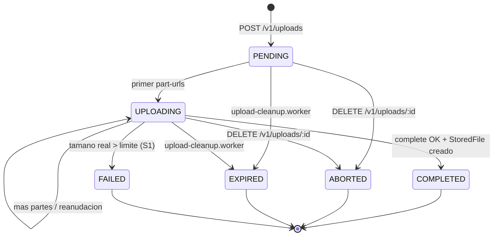

# Uploads (Chunked / Multipart)

Gestiona sesiones efímeras de subida multipart directa a S3 / SeaweedFS para archivos grandes (> 16 MiB), según la arquitectura definida en [LARGE_FILES_PLAN.md](../../../../LARGE_FILES_PLAN.md).

## Principio rector

> El cliente habla con Link para **decidir** y con el storage para **transferir**.
> Link nunca toca los bytes de un archivo grande.

## Endpoints

Base: `/api/v1/uploads`

| Método | Ruta | Descripción |
|---|---|---|
| `POST` | `/` | Inicia una sesión multipart (`PENDING`), crea el multipart en S3 y calcula `totalParts`. |
| `GET` | `/:id` | Consulta estado y partes subidas según `ListParts` autoritativo en storage. |
| `POST` | `/:id/part-urls` | Genera lote de hasta 20 URLs presignadas PUT (TTL 15 min). Pasa a `UPLOADING`. |
| `POST` | `/:id/complete` | Ensambla las partes, ejecuta verificación obligatoria **S1** (`HeadObject`), y crea el `StoredFile`. |
| `DELETE` | `/:id` | Cancela la sesión (`AbortMultipartUpload`) y la marca como `ABORTED`. |

Todas las rutas requieren autenticación (`authenticate` + `attachInternalUser`).

---

## Ciclo de vida y máquina de estados (`FileUploadStatus`)

- **Deliberadamente no hay tabla de partes en base de datos**: `ListParts` del storage es la única fuente de verdad autoritativa (partes y ETags). Esto previene desincronizaciones y derivas de estado.
- Los ETags nunca son provistos por el cliente: Link los toma directamente de `ListParts`.

---

## Garantías de seguridad implementadas

1. **S1 — HeadObject obligatorio al completar**:
   El cliente solo declara un tamaño previo. Tras ejecutar `CompleteMultipartUpload`, Link llama de inmediato a `s3.stat(objectKey)` (`HeadObject`). Si el tamaño real supera `AppSettings.maxUploadSizeMb` o es `<= 0`, se borra el objeto con `DeleteObject`, se marca la sesión como `FAILED` y se responde `400 Bad Request`.
2. **S5 — Cuota de sesiones activas por usuario**:
   Un usuario autenticado no puede tener más de 5 sesiones concurrentes en estado `PENDING` o `UPLOADING`. Evita ataques de agotamiento de disco/recursos (retorna `409 Conflict`).
3. **S8 — Rate limit en generación de URLs (`partUrlsRateLimiter`)**:
   Límite de 120 peticiones por usuario en ventanas de 15 minutos, con lotes acotados a un máximo de 20 partes por solicitud.
4. **S11 — Control de acceso estricto (Anti-IDOR)**:
   Solo el usuario creador (`createdById`) o un usuario con rol `admin` puede consultar, solicitar URLs, completar o abortar una sesión. Cualquier otro usuario recibe `403 Forbidden`.
