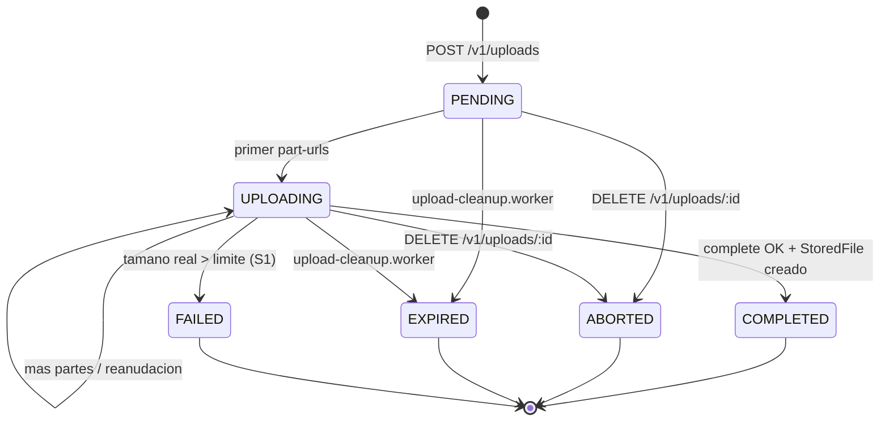

# Uploads (Chunked / Multipart)

Gestiona sesiones efímeras de subida multipart directa a S3 / SeaweedFS para archivos grandes (> 16 MiB), según la arquitectura definida en [LARGE_FILES_PLAN.md](../../../../docs/design/LARGE_FILES_PLAN.md).

## Principio rector

> El cliente habla con Link para **decidir** y con el storage para **transferir**.
> Link nunca toca los bytes de un archivo grande.

## Endpoints

Base: `/api/v1/uploads`

| Método | Ruta | Descripción |
|---|---|---|
| `POST` | `/` | Inicia una sesión multipart (`PENDING`), crea el multipart en S3 y calcula `totalParts`. |
| `GET` | `/:id` | Consulta estado y partes subidas según `ListParts` autoritativo en storage. |
| `POST` | `/:id/part-urls` | Genera lote de hasta 20 URLs presignadas PUT (TTL 15 min). Pasa a `UPLOADING`. |
| `POST` | `/:id/complete` | Ensambla las partes, ejecuta verificación obligatoria **S1** (`HeadObject`), y crea el `StoredFile`. |
| `DELETE` | `/:id` | Cancela la sesión (`AbortMultipartUpload`) y la marca como `ABORTED`. |

Todas las rutas requieren autenticación (`authenticate` + `attachInternalUser`).

---

## Ciclo de vida y máquina de estados (`FileUploadStatus`)



- **Deliberadamente no hay tabla de partes en base de datos**: `ListParts` del storage es la única fuente de verdad autoritativa (partes y ETags). Esto previene desincronizaciones y derivas de estado.
- Los ETags nunca son provistos por el cliente: Link los toma directamente de `ListParts`.

---

## Parámetros de Fragmentación y Rendimiento

* **Tamaño de parte**: **8 MiB** (`PART_SIZE_BYTES = 8 * 1024 * 1024`).
  - Satisface el mínimo de S3 (5 MiB).
  - Admite archivos de hasta 78 GiB dentro del límite de 10 000 partes de S3.
  - Cada fragmento pasa holgadamente por el límite de 100 MB por request de Cloudflare.
* **Lotes de presignado**: Hasta **20 partes** por llamada a `POST /:id/part-urls` con TTL de 15 minutos (900 segundos).
* **Concurrencia cliente**: Recomendado 4 partes en paralelo (32 MiB en vuelo máximo), saturando la conexión sin ahogar el navegador ni la memoria.

---

## Detalle de Endpoints y Payloads

### 1. `POST /api/v1/uploads` — Iniciar sesión
Body:
```json
{
  "originalName": "video_quirurgico.mp4",
  "mimeType": "video/mp4",
  "totalSize": 157286400,
  "conversationId": "uuid-opcional"
}
```
Respuesta `201 Created`:
```json
{
  "id": "uuid-upload-session",
  "chunkSize": 8388608,
  "totalParts": 19,
  "status": "PENDING"
}
```

### 2. `POST /api/v1/uploads/:id/part-urls` — Obtener URLs de partes
Body:
```json
{
  "partNumbers": [1, 2, 3, 4]
}
```
Respuesta `200 OK`:
```json
{
  "parts": [
    { "partNumber": 1, "url": "https://storage.../partNumber=1&X-Amz-Signature=..." },
    { "partNumber": 2, "url": "https://storage.../partNumber=2&X-Amz-Signature=..." }
  ]
}
```

### 3. `GET /api/v1/uploads/:id` — Consultar progreso / Reanudación
Respuesta `200 OK`:
```json
{
  "id": "uuid-upload-session",
  "status": "UPLOADING",
  "totalParts": 19,
  "chunkSize": 8388608,
  "uploadedParts": [1, 2, 3]
}
```

### 4. `POST /api/v1/uploads/:id/complete` — Ensamblar y finalizar
Body: `{}` (Link consulta `ListParts` a S3 automáticamente para armar el manifiesto).

Respuesta `201 Created`:
```json
{
  "file": {
    "id": "uuid-stored-file",
    "originalName": "video_quirurgico.mp4",
    "mimeType": "video/mp4",
    "extension": "mp4",
    "size": 157286400,
    "url": "/api/v1/files/uuid-stored-file/content?t=...",
    "createdAt": "2026-09-10T18:00:00.000Z"
  }
}
```

---

## Proceso de Limpieza en Segundo Plano (`upload-cleanup.worker.ts`)

Las subidas multipart que no llegan a completarse (por ejemplo, si el usuario cerró la pestaña o perdió la conexión definitivamente) dejan partes almacenadas en el bucket S3 ocupando espacio en disco.

* **Frecuencia**: Se ejecuta periódicamente (o en el arranque).
* **Criterio de expiración**: Sesiones en estado `PENDING` o `UPLOADING` cuya última actualización supere las **24 horas** (`TTL_INACTIVE_HOURS = 24`).
* **Acción ejecutada**:
  1. Llama a `s3.abortMultipartUpload(upload.objectKey, upload.uploadId)` para que SeaweedFS/S3 purgue físicamente los fragmentos.
  2. Actualiza el estado de la sesión en base de datos a `EXPIRED`.

---

## Garantías de seguridad implementadas

1. **S1 — HeadObject obligatorio al completar**:
   El cliente solo declara un tamaño previo. Tras ejecutar `CompleteMultipartUpload`, Link llama de inmediato a `s3.stat(objectKey)` (`HeadObject`). Si el tamaño real supera `AppSettings.maxUploadSizeMb` o es `<= 0`, se borra el objeto con `DeleteObject`, se marca la sesión como `FAILED` y se responde `400 Bad Request`.
2. **S5 — Cuota de sesiones activas por usuario**:
   Un usuario autenticado no puede tener más de 5 sesiones concurrentes en estado `PENDING` o `UPLOADING`. Evita ataques de agotamiento de disco/recursos (retorna `409 Conflict`).
3. **S8 — Rate limit en generación de URLs (`partUrlsRateLimiter`)**:
   Límite de 120 peticiones por usuario en ventanas de 15 minutos, con lotes acotados a un máximo de 20 partes por solicitud.
4. **S11 — Control de acceso estricto (Anti-IDOR)**:
   Solo el usuario creador (`createdById`) o un usuario con rol `admin` puede consultar, solicitar URLs, completar o abortar una sesión. Cualquier otro usuario recibe `403 Forbidden`.
