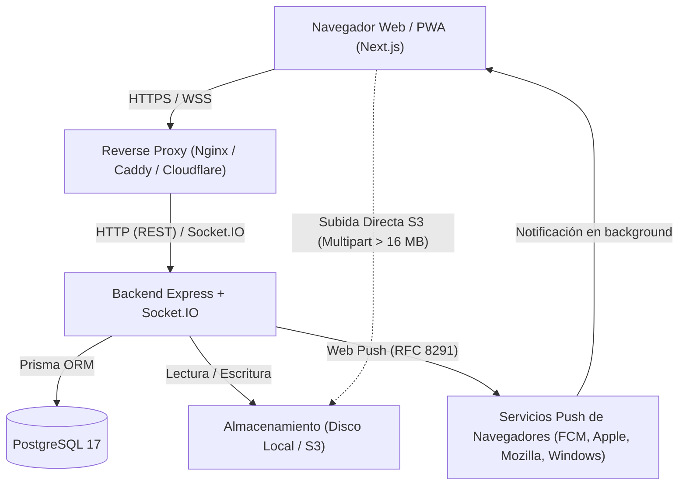
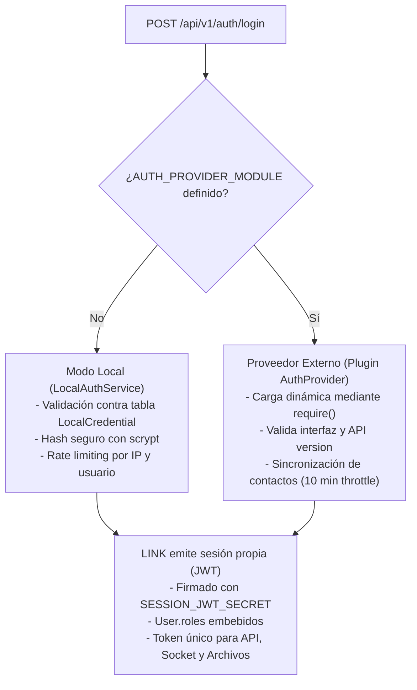
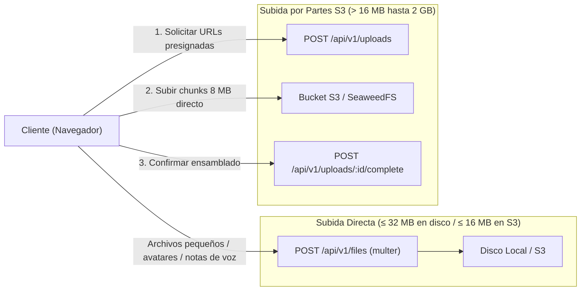

# Arquitectura de LINK

Este documento describe la arquitectura global del sistema **LINK**, sus componentes principales, flujos de datos, decisiones de diseño, modelo de seguridad y limitaciones operativas comprobadas.

---

## 1. Visión General del Sistema

LINK es una plataforma de mensajería y colaboración en tiempo real para equipos y organizaciones, diseñada para despliegues auto-hospedados (*self-hosted*) con total soberanía sobre los datos. El repositorio está organizado como un **monorepo con npm Workspaces**:

- **Backend (`backend/`)**: Servicio en Node.js con Express, Socket.IO, Prisma ORM y TypeScript. Expone la API RESTful y el canal de eventos bidireccional en tiempo real.
- **Frontend (`frontend/`)**: Aplicación web SPA/PWA construida sobre Next.js (App Router), React, Tailwind CSS y TypeScript.
- **Base de Datos**: PostgreSQL (versión 17 recomendada).
- **Almacenamiento de Objetos**: Sistema dual compatible con disco local (`LOCAL`) o almacenamiento compatible con Amazon S3 (`S3`, como SeaweedFS, MinIO o AWS S3).

---

## 2. Componentes y Flujos de Comunicación

### 2.1 API RESTful y Ciclo de Vida HTTP
- **Prefijo base**: `/api/v1` (servido en el puerto configurado por `PORT`, por defecto `4000`).
- **Autenticación**: Cabecera estándar `Authorization: Bearer <session_jwt>`. Todas las rutas privadas exigen este token.
- **Correlación de peticiones (`x-request-id`)**: Cada solicitud genera o propaga un UUID v4 (`x-request-id`) inyectado en el contexto de la petición (`RequestContext`). Dicho identificador vincula las trazas de logs estructurados (Pino) con las entradas correspondientes en el registro de auditoría (`AuditLog.requestId`).
- **Control de errores unificado**: Respuestas JSON con formato `{ error: string, code?: string }`, mapeando códigos HTTP semánticos (`400`, `401`, `403`, `404`, `413`, `429`, `503`).

### 2.2 Comunicación en Tiempo Real (Socket.IO)
- **Servidor Socket.IO**: Vinculado al mismo servidor HTTP del backend.
- **Autenticación en el Handshake**: Se valida el `session_jwt` suministrado en `socket.handshake.auth.token`.
- **Estructura de Rooms**:
  - `user:<userId>`: Canal privado de cada usuario para las actualizaciones de su lista de conversaciones, las notificaciones personales, la recepción de llamadas y la señalización. LINK todavía no emite eventos de presencia (usuario en línea o desconectado).
  - `conversation:<conversationId>`: Canal por conversación para difusión de mensajes nuevos (`message:created`), ediciones, eliminaciones, reacciones y eventos efímeros ("escribiendo...").
- **Señalización WebRTC (Llamadas 1 a 1)**:
  - Las llamadas de audio y video usan Socket.IO exclusivamente como canal de señalización (ofertas, respuestas y candidatos ICE).
  - La media (audio/video) viaja P2P directamente entre los navegadores.
  - El servidor valida de forma estricta que la señalización se intercambie únicamente entre los participantes activos de una llamada válida en curso y descarta mensajes de señalización con tamaño superior a 64 KiB.
- **Expiración de Conexión en Vivo**: Cuando expira el tiempo de validez del JWT de la sesión, la conexión de socket es terminada automáticamente por el servidor.

---

## 3. Modelo de Autenticación y Extensibilidad

LINK admite dos modos de autenticación definidos a nivel de instalación:

### 3.1 Modo Local (Por Defecto)
- Las cuentas y credenciales residen en la base de datos de LINK (modelos `User` y `LocalCredential`).
- Las contraseñas se almacenan mediante el algoritmo `scrypt` con sal única por usuario y mitigación contra análisis de tiempos (*timing attacks*).
- Incluye política de contraseñas configurable en tiempo de ejecución: longitud mínima (≥ 12 caracteres por defecto, ajustable entre 8 y 128), requisitos de caracteres (mayúsculas, minúsculas, números, símbolos), historial de contraseñas no reutilizables, vencimiento periódico y bloqueo temporal por intentos fallidos consecutivos.
- Cambio de contraseña obligatorio al iniciar sesión con contraseñas temporales, vencidas o restablecidas por un administrador.

### 3.2 Proveedores Externos mediante Plugins (`AuthProvider`)
- Permite delegar la autenticación a sistemas corporativos (SSO, LDAP, servicios propietarios) sin bifurcar el código del núcleo.
- Se configura mediante `AUTH_PROVIDER_MODULE`, que apunta a un archivo JavaScript CommonJS absoluto o paquete local.
- Cumple el contrato versionado `AuthProvider` (`backend/src/auth-providers/api.ts`, controlado por `AUTH_PROVIDER_API_VERSION`).
- **LINK siempre emite su propia sesión**: El proveedor externo solo valida credenciales en el inicio de sesión. Una vez validado, LINK emite su propio token firmado con `SESSION_JWT_SECRET`. El token externo nunca es utilizado para autorizar peticiones subsiguientes ni el canal de sockets.
- Directorio de usuarios sincronizado en segundo plano con limitación de frecuencia (*throttle* de 10 minutos) para no saturar al proveedor ni degradar la experiencia de usuario.

---

## 4. Almacenamiento Dual de Archivos

Para optimizar recursos y no bloquear el bucle de eventos (*event loop*) de Node.js, LINK implementa una arquitectura dual de subida centralizada bajo el modelo `StoredFile`:

1. **Subida Directa**:
   - Para avatares, notas de voz, imágenes de grupos y adjuntos convencionales.
   - Procesada a través de `POST /api/v1/files` con `multer`.
   - Límite máximo: **32 MB** cuando se usa almacenamiento en disco local (`STORAGE_WRITE_PROVIDER=LOCAL`), o 16 MiB si se utiliza `S3`.
2. **Subida Chunked Multipart (Exclusiva para S3)**:
   - Para archivos de gran tamaño (hasta 2 GB por defecto).
   - El cliente divide el archivo en fragmentos de 8 MiB y solicita URLs presignadas PUT a LINK (`POST /api/v1/uploads`).
   - Los datos binarios viajan directamente desde el cliente hacia el almacenamiento S3, sin consumir memoria RAM ni ancho de banda en el servidor de Node.js.
   - Al finalizar, LINK valida la integridad y tamaño real mediante `HeadObject` antes de crear el registro definitivo en `StoredFile`.
3. **Descarga y Acceso Seguro**:
   - No existe directorio estático público expuesto.
   - El acceso al contenido se efectúa en `GET /api/v1/files/:id/content` mediante token HMAC temporal (`?t=...`, validez de 1 hora) o cabecera `Authorization: Bearer`.
   - Para archivos en disco local, el backend transmite con validación de permisos. Para archivos en S3, redirige mediante `302` a una URL presignada GET con TTL de 5 minutos.
   - Respuestas protegidas con `X-Content-Type-Options: nosniff` y `Content-Security-Policy: default-src 'none'; sandbox`.
4. **Procesos en Segundo Plano (Workers)**:
   - `upload-cleanup.worker.ts`: Barrendero periódico que cancela y purga en S3 subidas multipart abandonadas o inactivas (> 24 horas).
   - `file-migration.worker.ts`: Migración asistida en caliente de archivos desde almacenamiento local hacia S3.

---

## 5. Modelo de Datos y Persistencia

El modelo de datos está definido en `backend/prisma/schema.prisma` y gestionado mediante Prisma ORM con `@prisma/adapter-pg` sobre PostgreSQL:

- **`User`**: Perfil interno del usuario en la plataforma (nombre, correo, avatar, roles y estado). Es la clave primaria de todas las relaciones del sistema (`id: UUID`), garantizando estabilidad independientemente del proveedor de autenticación.
- **`LocalCredential`**: Credenciales de acceso para modo local (hash scrypt, sal, requisitos de cambio, historial de contraseñas y contador de intentos fallidos).
- **`Conversation`**: Entidad de chat (`type: PRIVATE | GROUP | SELF`). Contiene metadatos, imagen y referencias denormalizadas al último mensaje (`lastMessageId`, `lastMessageAt`) para lecturas eficientes.
- **`ConversationMember`**: Pertenencia y permisos de un usuario en una conversación, con control de entrega (`lastDeliveredMessageId`) y lectura (`lastReadMessageId`).
- **`Message`**: Mensaje persistido (`type: TEXT | SYSTEM | STICKER | CONTACT | POLL | CALL`). Almacena contenido, relaciones a hilos/respuestas (`replyToId`), reenvíos (`forwardedFromId`) y marcas de eliminación lógica.
- **`StoredFile` y `MessageFile`**: Separación estricta entre metadatos del archivo físico y su asociación con uno o más mensajes.
- **`AuditLog`**: Registro de auditoría de eventos normativos del sistema (acceso, cambios administrativos, moderación). La aplicación solo agrega registros y nunca los modifica; únicamente la retención configurable (`AppSettings.auditLogRetentionDays`, desactivada por defecto) los borra.
- **`AppSettings`**: Configuración dinámica de la plataforma editable en tiempo de ejecución por administradores sin necesidad de reiniciar el servicio.

---

## 6. Seguridad y Privacidad

1. **Protección contra Abuso y Rate Limiting**:
   - Rate limiting multicapa en memoria: por combinación de usuario e IP, y tope global por usuario.
   - Configuración rigurosa de proxys inversos (`TRUST_PROXY` y `TRUST_CF_CONNECTING_IP`) para prevenir la falsificación de direcciones IP de origen.
   - Límite de eventos por socket para evitar saturación del servidor o denegación de servicio a otros clientes.
2. **Validación de Archivos y Contenidos**:
   - Inspección de firmas binarias reales (*magic numbers*) para ejecutables, archivos comprimidos, PDF, imágenes y audio/video, evitando evasiones por spoofing de extensión.
   - Verificación de duración real en notas de voz mediante análisis de buffers (`music-metadata`).
3. **Restricción de Notificaciones Push**:
   - Solo se aceptan suscripciones dirigidas a endpoints oficiales HTTPS de navegadores reconocidos (`fcm.googleapis.com`, `push.services.mozilla.com`, `notify.windows.com`, `push.apple.com`).
4. **Políticas de Privacidad de Logs y Auditoría**:
   - **Regla estricta**: Nunca se registran contraseñas, tokens JWT, payloads HTTP crudos ni el contenido de los mensajes de chat.
   - Separación categórica entre logs operacionales (Pino) y el audit trail normativo (`AuditLog`).
   - Identificación de actores mediante UUID interno en logs, resguardando datos personales.

---

## 7. Limitaciones Técnicas y Operativas Verificadas

1. **Instancia Única de Backend**:
   - El backend debe ejecutarse como **un único proceso** (o una única instancia en contenedor). Socket.IO no dispone de adaptador distribuido (Redis Streams o Redis Pub/Sub), y los límites de rate limiting residen en la memoria local del proceso. Múltiples instancias provocarían pérdida de eventos en tiempo real y división de cupos de rate limit.
2. **Subida por Partes Limitada a S3**:
   - Archivos mayores a 32 MB requieren obligatoriamente un almacenamiento compatible con S3 (`STORAGE_WRITE_PROVIDER=S3`). El almacenamiento en disco local no implementa subida por partes y rechaza archivos superiores a 32 MB.
3. **Topología de Llamadas P2P (1 a 1)**:
   - La funcionalidad de llamadas WebRTC es exclusivamente entre pares (*peer-to-peer mesh* 1 a 1). No incluye servidor de medios centralizado (SFU/MCU) para llamadas grupales de audio o video.
4. **Cifrado de Mensajes**:
   - Los mensajes se transmiten cifrados en tránsito (TLS/WSS) y pueden respaldarse cifrados en reposo en la base de datos o almacenamiento, pero **no cuentan con cifrado de extremo a extremo (E2EE)**. Esto permite moderación, búsqueda interna en servidor y auditoría corporativa.
